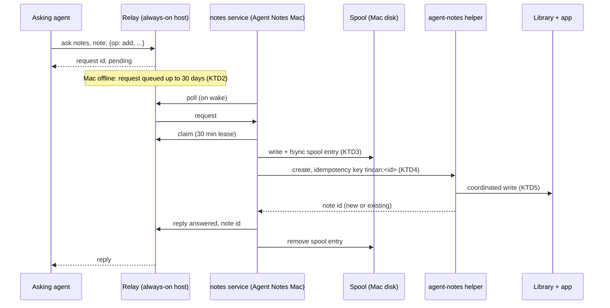
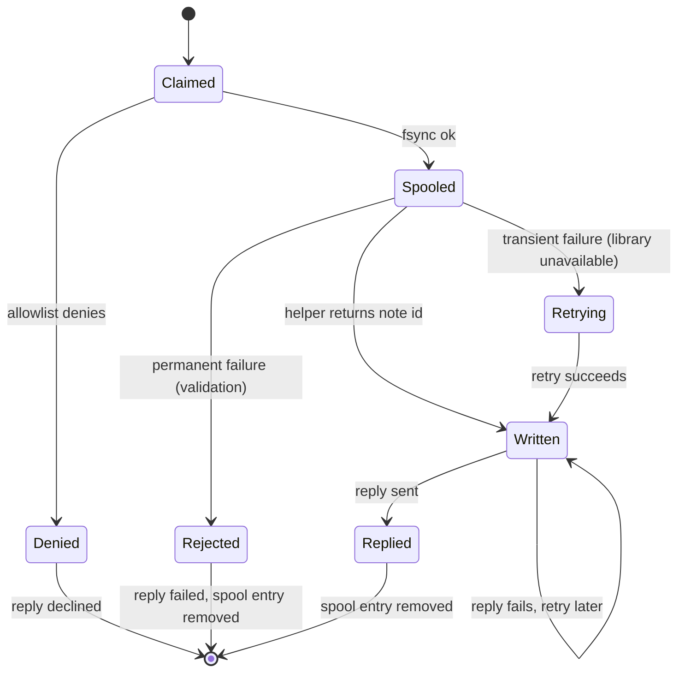

# Agent Notes Tincan Teammate - Plan

Target repos: agent-tincan (this repo, most units) and agent-notes-mac (U1 only). Paths in U1 are relative to agent-notes-mac; all other paths are relative to agent-tincan.

---

## Goal Capsule

- Objective: any agent on the owner's Tincan team can save a note into Agent Notes or find and read one back, and a note an agent asked to save is never silently lost, even when the Mac running Agent Notes is asleep or offline for days.
- Means: a new non-model Tincan service agent named `notes` on the Agent Notes Mac, built on the `history` service pattern and driving the app's bundled `agent-notes` helper (KTD1), with relay-side long retention and a local spool for durability (KTD2, KTD3).
- Authority: Requirements (R) win on product behavior; KTDs win on mechanism within their cited Rs; units override neither.
- Stop conditions: stop and ask if the `agent-notes` helper cannot be made to create notes idempotently without app changes beyond U1, or if relay per-recipient TTL would require a relay schema migration.
- Execution profile: two repos, Go (agent-tincan) and Swift (agent-notes-mac). U1 ships in an Agent Notes release before U3 can run end to end; U2 needs a relay upgrade on the relay host.
- Who finishes: the implementer lands both repos' changes; the owner upgrades the relay host and installs the service on the Agent Notes Mac.

---

## Product Contract

### Summary

Add `notes`, a Tincan teammate that runs on the Mac with Agent Notes and connects out to the relay like `history` does. Teammates ask it to add a note, search notes, or read a note. Adds are durable end to end: the relay holds them for 30 days while the Mac is away, and the Mac spools each claimed add until it is on disk. Agent Notes itself stays network-free and keeps syncing through CloudKit.

### Problem Frame

Agent Notes is local-first. Notes are Markdown files on one Mac, synced to other Apple devices through the owner's private CloudKit database. There is no Agent Notes server, so an agent on a cloud VM, in a sandbox, or on a phone has no way to put a note there or pull one out. The owner ends up copy-pasting between agents and the notes app, which is exactly the job Tincan was built to remove.

Tincan already solves "reach a service on my Mac from anywhere" for chat history and the web agents: a small service on the Mac dials out to the relay over Tailscale, and the relay queues requests while the Mac is away. The gap is that the relay drops unanswered requests after 24 hours, which is fine for questions but not for notes. The owner's bar is explicit: do not lose notes.

### Requirements

Capabilities
- R1. A teammate can add a note with a title, a Markdown body, and optional tags, and gets back the new note's id once it exists in the library.
- R2. A teammate can search notes by text and gets back up to 20 matches with id, title, tags, and a short snippet.
- R3. A teammate can read a note by id and gets back its title, tags, and body; bodies over the reply cap are truncated with a visible notice.
- R4. Requests work as structured JSON with no model involved; free-text requests are also accepted and turned into a structured request by a no-tools model step. A free-text add stores the sender's text verbatim as the body; the model only chooses the operation, title, and tags.

Durability
- R5. An add that reaches the relay is never dropped because the Mac was offline, asleep, or the service was down, for at least 30 days.
- R6. An add is applied at most once: relay redelivery, service restarts, and crashes mid-write never create duplicate notes, including when the user has since archived or trashed the note.
- R7. When an add cannot be applied yet (library missing, helper failing), it is kept and retried on the Mac rather than answered as failed.
- R8. If an add does expire unanswered, the asker receives the `expired` status, and the standing instructions tell agents to surface that to the owner.

Provenance and trust
- R9. Every note created through Tincan records which agent asked, the request id, and the trace id, and carries a `from-agent` tag, so the owner can find and review them in the app.
- R10. v1 never edits, retags, archives, or trashes an existing note.
- R11. Read access and add access are governed by separate allowlists; with no allowlist file, every joined teammate is allowed, matching `history`.
- R12. A note created remotely appears in the open Agent Notes window without a relaunch, and one created while the app is closed appears on next launch and syncs normally.

### Acceptance Examples

- AE1. Covers R5, R7. Given the Mac is asleep for three days, when Grok Bot asks `notes` to save a note, then Grok Bot sees the request pending, and within a minute of the Mac waking the note exists and Grok Bot gets the reply with its id.
- AE2. Covers R6. Given the service crashes after the note file is written but before it replies, when the relay requeues the request after the claim lease, then the service replies with the same note id and no second note exists.
- AE3. Covers R6. Given an add was applied and the owner then trashed that note, when the same request is redelivered, then no new note is created and the reply names the trashed note.
- AE4. Covers R4. Given the free-text request "save this: buy the blue tent, not the green one", then the body is exactly that text and nothing a model wrote.

### Scope Boundaries

- No Agent Notes cloud service, public endpoint, or API; the relay on the owner's tailnet is the only path in.
- No note editing, append, deletion, or tag changes (R10).
- No attachments in or out of notes in v1.
- No reads from archived or trashed notes by default; search covers active notes.

#### Deferred to Follow-Up Work

- Append to a note the same agent created. Needs a per-request marker so a redelivered append cannot double-append; the hash-checked `patch` alone does not give that.
- Full-text index search through the app instead of the helper's substring scan.
- Per-note privacy (a tag or property that hides a note from `notes` reads).
- Surfacing a "saved by agents" view in the Agent Notes UI beyond the `from-agent` tag.

---

## Planning Contract

### Key Technical Decisions

- KTD1. The service lives in agent-tincan and drives the bundled `agent-notes` helper. The Agent Notes app never talks to the relay. This keeps the app's no-network security model intact, reuses the helper's library scoping, hash checks, and atomic writes, and matches how `history` and the web agents are built. The rejected option, the app joining the relay itself, would add networking, Tailscale identity, and a background loop to an app that deliberately has none.
- KTD2. The relay retention for a request is chosen by the recipient's kind: the new `notes` kind gets 30 days, all others keep 24 hours. `Store.Enqueue` already takes a TTL per call (`internal/store/store.go`), and agent kind is already stored on the agents table, so this is a lookup at enqueue time in `internal/relay/server.go`, not a schema change. A relay flag lets the owner override the notes TTL.
- KTD3. Durability on the Mac is a local spool plus an idempotency key in the note itself. On claim the service writes the full request to a spool file and fsyncs it before touching the library, then creates the note with key `tincan:<request id>`, then replies, then removes the spool entry. The key in the note's properties is what prevents duplicates (R6), because it survives service reinstalls and spool loss; the spool is what prevents loss after claim (R7). This mirrors the web agents' send journal (`internal/history/web_journal.go`), which keys requeued work by request id.
- KTD4. Idempotent create is a helper feature, not service logic. `agent-notes create` gains a property input and an idempotency key; when a note in any state already carries that key, it returns that note instead of creating one. Doing the lookup inside the helper keeps it next to the library code that owns frontmatter parsing.
- KTD5. Remote creates use a coordinated exclusive create. The running app watches the library through a file presenter, which is notified reliably only for coordinated writes. `LibraryActor.createNote` goes through `AtomicFileWriter.createExclusive`, which deliberately skips coordination (a coordinated create can wait behind an unrelated presenter), and its access mode only affects `write()`. So U1 adds a background-only variant that wraps the exclusive create in an `NSFileCoordinator` write on the new note's URL, leaving foreground creates unchanged. This gives R12 without the `agentnotes://` action that needs a session receipt.
- KTD6. Structured-first request format under a `note:` prefix, parallel to history's `query:` form, with a Codex no-tools extractor for free text that copies `history`'s extractor setup (read-only sandbox, no MCP, ephemeral, strict output schema). For adds, the extractor never produces the body (R4). When extraction fails, the service never guesses the operation: it lets the relay redeliver, and after three failed attempts replies `failed` with the structured form to resend, saving nothing.
- KTD9. Retries never block the poll loop. Helper failures are split into permanent ones (validation errors, unknown flags) that reply `failed` and clear the spool entry, and transient ones (library unavailable, operation failed) that keep it. A transient add returns without replying; the relay requeues it after the 30-minute claim lease, and a background timer retries spooled entries in between. The startup drain tries each entry once and never delays polling, so one stuck add cannot stall searches, reads, or other adds.
- KTD7. New package `internal/notes`, not more code in `internal/history`. It imports history's exported `LoadAllowlist`/`FileAllowlist` and needs `chainDenied` and the polling loop; export those two helpers from `internal/history` rather than copying them or restructuring history.
- KTD8. The service runs the helper with its own Application Support root (`AGENT_NOTES_APPLICATION_SUPPORT_ROOT`) and the owner-chosen library root, so it never inherits an in-app agent session's turn contract and cannot fail with `turn_context_invalid`.

### High-Level Technical Design

Add flow, including the offline and crash paths:



Service handling of one claimed add, by state:



A redelivered request that finds its spool entry skips straight to the helper call; the idempotency key makes that call return the same note.

Request grammar, directional:

```text
note: {"op":"add","title":"...","body":"...","tags":["..."]}
note: {"op":"search","query":"...","count":10}
note: {"op":"read","id":"<note uuid>"}
anything else -> free text -> extractor -> one of the above (add keeps text verbatim)
```

### Assumptions

- The relay host (currently Grok Bot's VM) stays up; relay disk loss is outside this plan's durability promise.
- The Agent Notes library is on the Mac's internal disk or an always-mounted volume; an unmounted library is handled by R7's retry, not by relocating notes.
- The helper's substring search is fast enough for the owner's library size at v1.

### Sequencing

U1 (agent-notes-mac) and U2 (relay TTL) are independent and can land in parallel. U3 depends on U1 being in an installed Agent Notes release, and on U2 being deployed to the relay before AE1 (the three-day-offline case) can be verified. U4 and U5 depend on U3. U6 lands last.

---

## Implementation Units

### U1. Idempotent, provenance-carrying remote create in the agent-notes helper

- Goal: `agent-notes create` can attach properties and an idempotency key, returns the existing note when the key is already present in any state, and writes through file coordination when run in background mode.
- Requirements: R6, R9, R12; KTD4, KTD5, KTD8.
- Dependencies: none.
- Files:
  - `Sources/AgentNotesCore/CLI/AgentNotesCommandEngine.swift`
  - `Sources/AgentNotesCore/Commands/AgentNotesCommandCatalog.swift`
  - `Sources/AgentNotesCore/Library/LibraryActor.swift`
  - `Tests/AgentNotesCoreTests/AgentNotesCLITests.swift`
  - `docs/agent-sessions.md`
- Approach:
  1. Extend the `create` path to accept a properties JSON object and an idempotency key, validated with the same metadata limits as tags.
  2. Store the key as a note property (for example `remote.request-id`) alongside `remote.agent`, `remote.trace-id`, and `remote.via`.
  3. Before creating, look up an existing note carrying the same key across active, archived, and trashed states; return it with an indicator that it already existed.
  4. Use `LibraryActor.createNote`'s existing properties parameter (the same one `AutomationNoteWriter` uses).
  5. Add a background-only coordinated exclusive create per KTD5; foreground creates keep today's uncoordinated path.
  6. `search` output gains a short snippet around the first match per note, so the service needs no extra `read` per hit (R2).
- Patterns to follow: `Sources/AgentNotesCore/Automations/AutomationNoteWriter.swift` for provenance properties and tags; existing `validateMetadata`/`validateSize` checks in the engine.
- Test scenarios:
  - Create with key K and properties returns a new note whose frontmatter carries K and the properties.
  - A second create with key K returns the first note's id and creates no file.
  - Create with key K after that note was trashed returns the trashed note, not a new one.
  - Create with key K after that note was archived returns the archived note.
  - Malformed properties JSON fails with a validation error and writes nothing.
  - Create without a key behaves exactly as today.
  - A background create while a `LibraryFilePresenter` is registered on the library notifies the presenter.
  - The same background create completes within a bounded time while a presenter is registered (no coordination stall).
  - `search` returns a snippet containing the matched text for each hit.
- Verification: CLI tests pass; a manual background create shows the note in an open Agent Notes window without relaunch.

### U2. Relay retention by recipient kind

- Goal: requests addressed to a `notes`-kind agent live 30 days unanswered; every other kind keeps 24 hours.
- Requirements: R5, R8; KTD2.
- Dependencies: none.
- Files:
  - `internal/relay/server.go`
  - `internal/cli/relay.go`
  - `internal/onboard/onboard.go`
  - `internal/relay/server_test.go`
- Approach:
  1. Add `notes` to the kinds list, `runtimeNames`, and `defaultWake` (`wait`, like `history`).
  2. Add a notes TTL to relay config with a 30-day default and a relay flag to override it.
  3. At enqueue, look up the recipient's kind and pass the matching TTL to `Store.Enqueue`.
- Patterns to follow: existing `RequestTTL` default handling in `internal/relay/server.go`; flag style in `internal/cli/relay.go`.
- Test scenarios:
  - A request to a `notes`-kind agent gets `expires_at` 30 days out; one to a `history` agent gets 24 hours.
  - With the override flag set to 72h, a notes request expires at 72h.
  - A notes request still queued at day 29 is delivered on the next poll.
  - A notes request past its TTL is swept to `expired` and the asker's `get` shows `expired`.
  - A claimed notes request whose lease lapses before its TTL goes back to `queued`.
  - An agent whose kind is unset gets the default TTL.
- Verification: `make test` passes; `tincan agents` lists `notes` with its kind.

### U3. The notes service: poll, spool, apply, reply

- Goal: a `notes` agent that claims requests, enforces allowlists, applies structured add/search/read through the helper, and never loses a claimed add.
- Requirements: R1, R2, R3, R5, R6, R7, R9, R10, R11; KTD1, KTD3, KTD7, KTD8, KTD9.
- Dependencies: U1 (released in Agent Notes), U2 for the 30-day window.
- Files:
  - `internal/notes/serve.go`
  - `internal/notes/request.go`
  - `internal/notes/helper.go`
  - `internal/notes/spool.go`
  - `internal/notes/serve_test.go`
  - `internal/notes/spool_test.go`
  - `internal/history/serve.go` (export `ChainDenied` and the polling loop)
- Approach:
  1. Poll and claim as `history.Service` does, one request at a time; retries run off the loop per KTD9.
  2. Before any parsing or extraction, decline unless the relay-set chain passes at least one of the two allowlists (`notes-allow.txt` for read, `notes-add-allow.txt` for add).
  3. Parse the strict `note:` JSON (unknown, repeated, or null fields rejected, as history's `query:` parser does), or hand free text to U4's extractor.
  4. Once the operation is known, check `ChainDenied` with that operation's allowlist.
  5. For add: validate title and tags against the helper's metadata rules, spool, call the helper with the idempotency key and provenance from `req.From`, `req.ID`, `req.TraceID`, reply, then clear the spool.
  6. For search and read: call the helper, keep only notes whose state is active, and format a fixed-template reply under the 64KB cap. A read of a non-active note gets the same not-found reply as an unknown id.
  7. On a transient helper failure for an add, keep the spool entry, post a `progress` note to the asker with the helper's error code, and return without replying (KTD9). Record the last helper result in a health file for `doctor` (U5).
  8. Every helper call sets `AGENT_NOTES_APPLICATION_SUPPORT_ROOT` to the service's own directory and `AGENT_NOTES_LIBRARY_ROOT` to the configured library (KTD8). The helper path defaults to `/Applications/Agent Notes.app/Contents/Helpers/agent-notes` and is configurable.
- Patterns to follow: `internal/history/serve.go` (`Handle`, `handleSafely`, `replyDetached`); `internal/history/web_journal.go` for request-id-keyed resume.
- Test scenarios:
  - A valid add returns `answered` with the note id; the helper was called with key `tincan:<id>`, `from-agent` tags, and provenance properties.
  - A valid search returns at most `count` results with ids, titles, and snippets.
  - Read of an unknown id returns `failed` with a clear message.
  - A read body over the cap is truncated and says so.
  - Covers AE2. The helper succeeds but the reply fails, the service restarts, and the request is redelivered: the helper is called again with the same key and the reply carries the same note id.
  - Covers AE1. With the helper failing (library missing), an add stays spooled and unanswered, and the asker gets a progress note; when the helper recovers, the add is applied and answered.
  - Covers AE3. A redelivered add whose note was created and then trashed replies with the trashed note's id and creates no new note.
  - With the helper failing for adds, a search queued behind the stuck add is still answered.
  - An add whose title contains a newline gets `failed` with the reason, its spool entry is cleared, and the next request is handled.
  - A search that matches only a trashed or archived note returns no results.
  - A read of an archived or trashed note id returns not found.
  - An agent on neither allowlist is declined before the extractor runs.
  - Every helper invocation carries the service's own Application Support root, and a stale in-app session context file does not cause `turn_context_invalid`.
  - With a spool entry present at startup and the relay request already expired, the note is still created and the failed reply is logged, not retried forever.
  - The add allowlist denies agent X: the request is declined and nothing is spooled or written.
  - X is on the read allowlist but not the add allowlist: search succeeds and add is declined.
  - A malformed `note:` body returns a fixed `failed` reply.
  - A search or read never writes a spool entry.
- Verification: `make test` passes, including race detection.

### U4. Free-text requests through the no-tools extractor

- Goal: free-text messages to `notes` work, with adds storing the sender's text verbatim.
- Requirements: R4, R11; KTD6.
- Dependencies: U3.
- Files:
  - `internal/notes/extract.go`
  - `internal/notes/extract_test.go`
- Approach: copy the `history` `CodexExtractor` setup with a notes schema that outputs operation, title, tags, and query only. For adds, the service sets the body to the original request text; the extractor output schema has no body field. Extraction failure follows KTD6: no reply until the third failed attempt, then `failed` with the structured form, and nothing saved.
- Patterns to follow: `internal/history/extract.go`.
- Test scenarios:
  - Covers AE4. A free-text save request produces an add whose body equals the original text byte for byte.
  - "what did I write about the tent" becomes a search with a sensible query.
  - Extractor output with a body field is rejected by the strict schema.
  - An extractor failure leaves the request unanswered for relay redelivery; the third consecutive failure replies `failed` with the structured `note:` example, and the helper is never called.
  - A free-text message from an agent on the read allowlist only, extracted as an add, is declined and nothing is spooled.
  - A structured `note:` request never invokes the extractor.
- Verification: `make test` passes; extractor tests use a fake runner, as history's do.

### U5. CLI wiring, install, and doctor

- Goal: `tincan notes serve` and `tincan notes install` exist, run under launchd with KeepAlive, and `tincan doctor` checks the notes setup.
- Requirements: R5, R12.
- Dependencies: U3.
- Files:
  - `internal/cli/notes.go`
  - `internal/cli/root.go`
  - `internal/notes/service.go`
  - `internal/notes/service_test.go`
- Approach:
  - Mirror `tincan history install`: write a `com.agenttincan.notes` plist with `TINCAN_CONFIG` set to the `notes` agent config, and print the `launchctl bootstrap` command rather than running it.
  - Doctor verifies that the helper exists and is executable, the spool directory is writable, and the relay is reachable.
  - Doctor reads the running service's health file for the last helper result, rather than probing the library itself. Doctor runs from Terminal with Terminal's folder grants, while the launchd service may be denied access to a protected folder such as Documents.
  - Doctor asks the relay for this agent's stored kind and fails loudly, printing the set-kind command, unless it is `notes`. Without that kind the relay silently applies the 24-hour window.
- Patterns to follow: `internal/cli/history.go`, `internal/history/service.go` (`installServiceDef`).
- Test scenarios:
  - The generated plist names the right binary, config path, and KeepAlive.
  - Doctor reports a missing helper with the expected install hint.
  - Doctor reports the service's last helper error from the health file (for example, library access denied).
  - Doctor fails when the relay reports no kind or a kind other than `notes`, including after a re-join through a kindless invite.
- Verification: `make test` passes; a manual install on the Agent Notes Mac shows `notes` online in `tincan agents`.

### U6. Onboarding, standing instructions, and docs

- Goal: agents know `notes` exists and how to use it, and the owner can set it up from `agents.txt`.
- Requirements: R8, R11.
- Dependencies: U2, U5.
- Files:
  - `internal/onboard/templates/agent.tmpl`
  - `internal/onboard/templates/operator.tmpl`
  - `site/agents.txt`
  - `docs/adapters/notes.md`
  - `README.md`
- Approach:
  - Add an `instructions.notes` block and operator routing text: to save or find a note, ask `notes`.
  - Use `ask` (not `notify`) for adds so a confirmation comes back. A pending add is queued, not lost.
  - An `expired` add may still be saved when the Mac returns. Before resending, search `notes` for the title, and report to the owner.
  - Add a part D to `agents.txt`: after the relay upgrade, create the agent with `tincan invite notes --kind notes`, join it, set the library root, run `notes install`, and grant the tincan binary Files and Folders access to the library location.
  - Add `docs/adapters/notes.md` with Allowlists, Request format, Durability, Install, Privacy, and Troubleshooting sections, and a row in the README platform table.
- Patterns to follow: `docs/adapters/history.md` layout; `site/agents.txt` part C.
- Test scenarios:
  - The onboard output for a `notes`-kind agent includes the notes instructions block.
  - The operator section mentions routing note requests to `notes`.
- Verification: `make test` passes (onboard template tests); docs render.

---

## Verification Contract

| Scope | Command | Proves |
|---|---|---|
| agent-tincan units | `make test` | U2 through U6 behavior, race-free |
| agent-tincan static | `make vet` and `make lint` | no new vet or lint findings |
| agent-notes-mac helper | `xcodebuild -project AgentNotes.xcodeproj -scheme AgentNotes -destination "platform=macOS,arch=$(uname -m)" CODE_SIGNING_ALLOWED=NO -only-testing:AgentNotesCoreTests/AgentNotesCLITests test` | U1 idempotency, provenance, coordination |
| End to end (manual) | Stop the notes service, have a teammate ask `notes` to add a note, restart the service after a few minutes | AE1: the note appears once, in the open app, and the asker gets the id |
| Crash path (manual) | Kill the service between the helper call and the reply, then restart | AE2: one note, same id in the eventual reply |

---

## Definition of Done

- Every R1 through R12 is covered by a passing test or a recorded manual check above.
- AE1 through AE4 are demonstrated.
- The relay on the owner's relay host is upgraded, and `notes` is installed and online on the Agent Notes Mac.
- `docs/adapters/notes.md`, `site/agents.txt`, and the README describe setup and the 30-day retention.
- No abandoned-approach code or unused exports remain in either repo's diff.

---

## Risks

- Idempotency lookup scans every note's frontmatter per add. That is fine for thousands of notes; if it proves slow, index the key in the library's existing cache (deferred).
- The file presenter may still miss coordinated writes in some edge case. U1's presenter test and the manual end-to-end check catch this before release.
- Reads send note bodies to any allowed teammate, including the ChatGPT connector in OpenAI's cloud. The default matches `history`; the notes adapter doc must say so plainly and show how to narrow the read allowlist.
- Until the relay is upgraded, adds keep the 24-hour window. The service works against an old relay, and the doc names the upgrade as required for the durability promise.

## Sources

- `internal/history/serve.go`, `internal/history/extract.go`, `internal/history/web_journal.go`, `internal/history/service.go`: service, extractor, journal, and install patterns.
- `internal/store/store.go` (`Enqueue` takes a TTL; `Sweep` handles lease-past-TTL) and `internal/relay/server.go` (`RequestTTL` default).
- agent-notes-mac `Sources/AgentNotesCore/CLI/AgentNotesCommandEngine.swift` (`create`), `Sources/AgentNotesCore/Library/AtomicFileWriter.swift` (direct vs coordinated access), `Sources/AgentNotesCore/Library/LibraryFilePresenter.swift`, `docs/sync-and-encryption.md`, `docs/security.md`.
