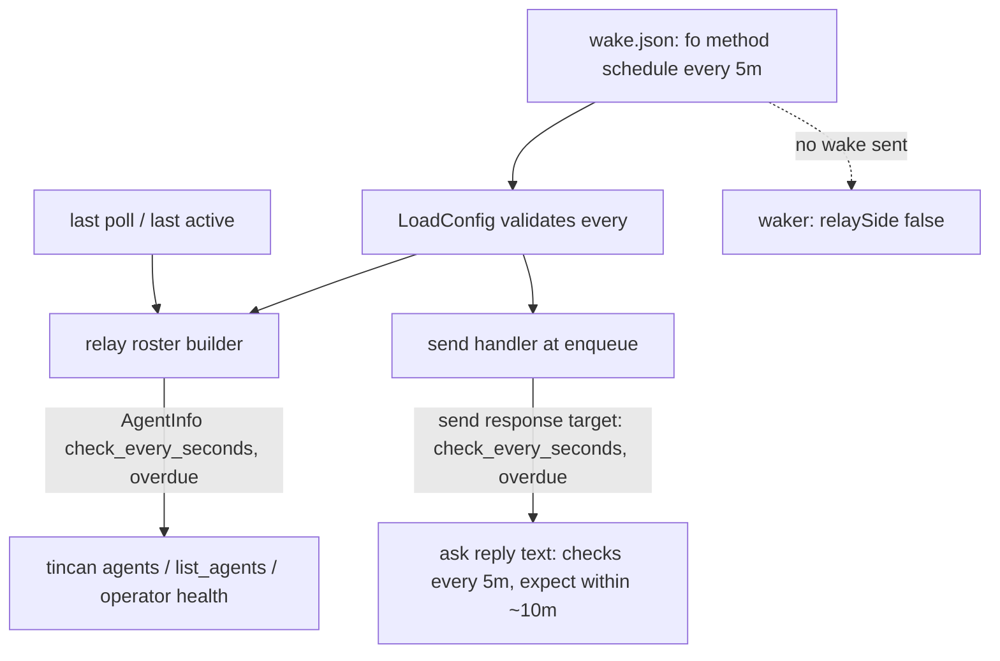

# Scheduled Agents (Fo) - Plan

---

## Goal Capsule

- Objective: an agent that cannot be woken but checks its inbox on its own schedule, like Fo on Wajo, is a first-class teammate: senders see how often it checks and when to expect a reply, the owner sees when it stops checking, and a fresh joiner is not failed by doctor for running a newer client than the relay.
- Means: a new relay wake method `schedule` with a check interval, surfaced in the roster and ask responses (KTD1, KTD2), plus a generic `scheduled` onboarding kind (KTD4) and a doctor/upgrade version fix (KTD5).
- Authority: Requirements (R) win on product behavior; KTDs win on mechanism within their cited Rs; units override neither.
- Stop conditions: stop and ask if showing the schedule to senders requires changing an existing `/v1` field or route rather than adding optional ones.
- Execution profile: Go, agent-tincan only. One PR. The relay host needs the new build and a wake.json entry for Fo after merge.
- Who finishes: the implementer lands the PR; the owner, in this order, upgrades the relay to the release, confirms Fo's actual cron interval, adds her schedule to wake.json and restarts the relay, sets her kind, and asks Fo to paste the new standing instructions into her cron. An older relay binary refuses to start with a `schedule` entry in wake.json and rejects the `scheduled` kind, so the upgrade comes first and a rollback removes the entry first.

---

## Product Contract

### Summary

Add a `schedule` wake method so the relay knows an agent checks every N minutes, and show that everywhere a sender or the owner looks: the roster, `list_agents`, the reply to an `ask`, and `doctor`. Add a generic `scheduled` kind whose standing instructions are written to live inside the agent's own cron job. Fix doctor and `tincan upgrade` so a client newer than the relay is a warning, not a failure or a silent downgrade.

### Problem Frame

Fo is an assistant on Wajo. Her `tincan` CLI runs in a Linux sandbox on the owner's tailnet, and a platform cron starts a fresh session every few minutes that checks her Tincan inbox. Nothing else can start her turns: she has no webhook, her email only accepts mail from Wajo users, and a listener in her sandbox cannot wake her. A text from the owner's own number also starts a turn.

Tincan has no word for this. Fo joined with no kind and `wake=none`, so the roster calls her offline and teammates are told she cannot be nudged. Grok Bot concluded her test request was stuck when it was simply waiting for her next check. Nobody can tell a healthy scheduled agent from one whose schedule stopped.

Separately, `install.sh` installs the newest GitHub release while the relay may still run an older one. Doctor compares the binary against the relay's release and fails any mismatch, and `tincan upgrade` "fixes" it by installing the relay's older build. Fo hit both on joining.

### Requirements

Schedule awareness
- R1. The relay's wake config accepts method `schedule` with a check interval (for example `"every": "5m"`); a missing, unparsable, or non-positive interval is a config error at relay start.
- R2. For a `schedule` agent the relay sends no wake, exactly as for `none` and `wait`.
- R3. The roster (`tincan agents`, `list_agents`) shows a schedule agent's interval, for example `wake=schedule (every 5m)`.
- R4. A schedule agent is marked overdue when it has not called the relay for longer than two intervals plus a 5-minute grace for late cron fires; the roster and the operator's health line show it.
- R5. When an `ask` returns before a schedule agent replies, the response tells the sender how often the target checks and when to expect a reply, instead of only "no reply yet".
- R6. Older clients and older relays keep working: every new roster and send-response field is optional, and no existing field or route changes meaning.

The scheduled kind
- R7. A `scheduled` onboarding kind exists, defaulting to wake method `schedule`, and is not expected online.
- R8. Its standing instructions are self-contained so they can be pasted into a cron job whose every run starts with no memory: check the inbox, handle and reply to each request, finish work waiting on replies, and contact the owner only when a request needs a human.
- R9. Its setup section tells the owner the wake.json entry (method `schedule`, interval, default 5 minutes), to set the agent's own cron to the same interval, and to use `tincan join --proxy` when the sandbox reaches the tailnet through a local proxy.
- R10. Docs describe the kind with Fo on Wajo as the worked example: an adapter doc, README tables and wake methods, and the `agents.txt` kinds list. No personal contact details appear in any doc.

Version mismatch
- R11. `tincan doctor` reports a client newer than the relay's release as a warning that names both versions and says to upgrade the relay, not as a failure.
- R12. `tincan upgrade` does not replace a newer client with the relay's older release unless `--force` is passed, and says why.

### Acceptance Examples

- AE1. Covers R3, R4. Given wake.json has `fo` on `schedule` every 5m and Fo last called the relay 3 minutes ago, `tincan agents` shows `wake=schedule (every 5m)` and no overdue marker; if her last call was 25 minutes ago, it shows her as overdue.
- AE2. Covers R5. Given the same config, `ask fo ...` that gets no reply within its wait returns text saying fo checks every 5 minutes and to expect a reply within about 10 minutes, plus the request id.
- AE3. Covers R11, R12. Given the relay's release is 0.7.0 and the client is 0.8.0, doctor exits 0 with a warning to upgrade the relay, and `tincan upgrade` leaves 0.8.0 in place without `--force`.

### Scope Boundaries

- No change to how any other wake method works.
- No per-request latency estimate beyond the schedule interval.
- Group asks (`also`) keep today's pending text; the schedule hint covers single-target asks.

#### Deferred to Follow-Up Work

- iMessage wake: an opt-in service on an always-on Mac signed into the owner's Messages that texts a scheduled agent "Agent Tincan: N requests waiting" from the owner's number (the only sender Fo accepts), capped like the email wake. Deferred because an always-on Mac is not a given.
- Pinning `install.sh` to the relay's release when joining with an invite.

---

## Planning Contract

### Key Technical Decisions

- KTD1. Schedule lives in the existing relay-local wake.json as a new method with an `every` duration field (Go duration string), validated in `LoadConfig` alongside the other methods. The waker's relay-side check already skips non-webhook, non-email methods, so no send path changes. The alternative, a per-agent field in the store set by `tincan kind`, would need a schema change and an admin route; wake.json is already where the owner declares how each agent is reached.
- KTD2. The relay computes schedule facts, clients only render them. `AgentInfo` gains optional `check_every_seconds` and `overdue` fields, filled from the wake config and last-seen time in the roster builder. The send response (the `ask` reply) gains an optional `target` object with the same two facts, filled for the recipient at enqueue. Because `Relay.Ask` and `AskAttached` return the result of a separate `Get` after sending, the send response's `target` must be carried onto the returned result: `envelope.Result` gains an optional wire-only `target` field that the client copies in on both the no-wait and the `Get` branch, so `FormatResult` can render it. Old clients ignore both; new clients against an old relay see no hint (R6).
- KTD3. Overdue is `now - lastPoll > 2 * every + 5m`, measured from the agent's last inbox poll, not general activity, so an agent that still sends asks but stopped checking its inbox is flagged. An agent that has never polled measures from its join time. The expected reply window shown to senders is `every + 5m` (one full wait plus Fo's stated up-to-5-minute late fire), computed by the relay and sent as `expect_reply_seconds` next to `check_every_seconds`, so clients never derive it.
- KTD4. The kind is generic (`scheduled`), not Fo-specific, and not a runtime name. `defaultWake` maps it to `schedule`; `expectOnline` is false. Its instructions are written for a fresh session each run (R8), since Fo's cron runs have no memory of prior chats.
- KTD5. Doctor uses `client.Newer` to split the existing hash mismatch into three outcomes: same release (ok), client older (fail, run `tincan upgrade`, as today), client newer (warn, naming both versions and telling the owner to run `tincan relay-upgrade --from-github v<client version>` from an admin device; a bare `relay-upgrade` would install the relay's own older dist release and be refused as not newer). `tincan upgrade` refuses a downgrade without `--force`.
- KTD6. `schedule` is added to the onboarding wake-method list and the operator troubleshooting text so the operator explains it: nothing to wake, expect replies within the interval, and a missed check means the agent's own cron stopped.

### High-Level Technical Design

Where the schedule facts flow:

### Assumptions

- Fo's cron moves to every 5 minutes (requested of her, not yet confirmed); wake.json uses her confirmed interval, and the owner keeps the two in step.

### Sequencing

U1 first (config and relay facts). U2 (rendering) depends on U1. U3 (kind and onboarding) depends on U1 for the method name. U4 (version fix) is independent. U5 (docs) last.

---

## Implementation Units

### U1. Schedule wake method and relay-side facts

- Goal: wake.json accepts `schedule` with `every`, and the relay reports each schedule agent's interval and overdue state in the roster and in the send response.
- Requirements: R1, R2, R4, R6; KTD1, KTD2, KTD3.
- Dependencies: none.
- Files:
  - `internal/wake/wake.go`
  - `internal/wake/wake_test.go`
  - `internal/client/relay.go`
  - `internal/client/attachments.go`
  - `internal/envelope/envelope.go`
  - `internal/relay/server.go`
  - `internal/relay/server_test.go`
- Approach:
  1. Add the `Schedule` method constant and an `Every` field on `Target`; validate it in `LoadConfig` and expose the interval through a small accessor next to `WakeMethod`.
  2. In the roster builder, fill `check_every_seconds` and `overdue` for schedule agents (a never-seen agent measures from its join time).
  3. In the send handler, attach the optional `target` object for a schedule recipient.
  4. In the client, decode the send response's `target` and copy it onto the `Result` that `Ask` and `AskAttached` return, on both the no-wait and `Get` branches (KTD2).
- Patterns to follow: `LoadConfig` per-method validation; the `WakeNamer` interface in `internal/relay/server.go`.
- Test scenarios:
  - A schedule entry with `every: "5m"` loads; missing, `"0s"`, negative, and unparsable intervals fail with the agent name in the error.
  - A request queued for a schedule agent triggers no webhook or email wake.
  - Roster for a schedule agent that polled 3m ago: interval 300s, not overdue; polled 25m ago: overdue even if it sent an ask 1m ago; never polled and just joined: not overdue; never polled and joined 30m ago: overdue.
  - Expected reply window is interval plus 5m (600s at 5m, 360s at 1m).
  - A non-schedule agent's roster entry has no interval or overdue field in the JSON.
  - Send to a schedule agent returns `target.check_every_seconds = 300`; send to a webhook agent omits `target`.
  - `Ask` with wait > 0 and with no wait against a schedule agent both return a `Result` carrying the target facts.
- Verification: `make test` passes; `tincan agents` against a test relay shows the new facts.

### U2. Render schedule facts to senders and the operator

- Goal: senders and the owner see the schedule wherever they look.
- Requirements: R3, R4, R5; KTD2, KTD6.
- Dependencies: U1.
- Files:
  - `internal/client/render.go`
  - `internal/client/render_test.go`
  - `internal/cli/agent.go`
  - `internal/mcpserver/server.go`
  - `internal/mcpserver/server_test.go`
  - `internal/onboard/templates/operator.tmpl`
- Approach:
  - Roster line: `wake=schedule (every 5m)`, and `overdue: last check 25m ago` when overdue, in both `formatAgents` and `list_agents`; update the `list_agents` description's method list.
  - Ask result: when the reply is not in and the response carries `target`, say "<name> checks its inbox every 5m; expect a reply within about 10m" before the existing request-id sentence.
  - Operator template: a `wake=schedule` troubleshooting line and the overdue marker in the health line.
- Test scenarios:
  - Covers AE1. Roster rendering for on-time and overdue schedule agents, in both CLI and MCP output.
  - Covers AE2. Ask with no reply against a schedule target includes the interval and expected wait, through both the MCP ask tool and the CLI `ask` with their default waits; against a webhook target the text is unchanged.
  - A response from an old relay (no `target`, no interval fields) renders exactly as today.
- Verification: `make test` passes.

### U3. The `scheduled` onboarding kind

- Goal: `tincan invite fo --kind scheduled` and `tincan onboard` produce correct standing instructions and setup for a scheduled agent.
- Requirements: R7, R8, R9; KTD4, KTD6.
- Dependencies: U1.
- Files:
  - `internal/onboard/onboard.go`
  - `internal/onboard/templates/agent.tmpl`
  - `internal/onboard/onboard_test.go`
  - `internal/onboard/shared_test.go`
- Approach:
  - Add `KindScheduled` to the kind list and `defaultWake` (`schedule`), not to `runtimeNames`; add `schedule` to both wake-method lists in `Build`.
  - Templates: `instructions.scheduled` written to be pasted into a cron job (fresh session each run), `setup.scheduled` (wake.json entry, matching cron interval, default 5 minutes, `join --proxy` tip), `title.scheduled`.
- Patterns to follow: `instructions.e2b-email` / `setup.e2b-email` and `proxy-sandbox` blocks.
- Test scenarios:
  - Onboard output for a `scheduled` agent includes the cron-ready instructions, the wake.json `schedule` entry with `every`, and the proxy tip.
  - The all-kinds rejoin and hygiene tests pass for the new kind.
  - `expectOnline` is false for `scheduled` with wake `schedule`.
- Verification: `make test` passes.

### U4. Newer client is not a doctor failure or a silent downgrade

- Goal: a fresh joiner on a newer release gets a warning, and upgrade never downgrades without being told to.
- Requirements: R11, R12; KTD5.
- Dependencies: none.
- Files:
  - `internal/cli/doctor.go`
  - `internal/cli/doctor_test.go`
  - `internal/cli/upgrade.go`
  - `internal/cli/upgrade_test.go`
- Approach: in `versionCheck`, when hashes differ compare versions with `client.Newer`; newer client warns per KTD5, older client keeps today's failure. In upgrade, when the relay's release is older than the running client, print both versions and exit without installing unless `--force`; `upgrade --check` says the same instead of telling a newer client to install.
- Test scenarios:
  - Covers AE3. Client newer than relay: doctor warns, exits 0, and the warning contains `relay-upgrade --from-github v<client version>`; upgrade keeps the binary and says to upgrade the relay; upgrade `--check` does not tell it to install; upgrade `--force` installs the relay's build.
  - Client older than relay: doctor still fails with the upgrade fix; upgrade installs as today.
  - Same release: both unchanged.
  - Unknown or unparsable version on either side: today's behavior.
- Verification: `make test` passes.

### U5. Docs

- Goal: owners can set up a scheduled agent from the docs, with Fo as the example.
- Requirements: R10.
- Dependencies: U1, U3, U4.
- Files:
  - `docs/adapters/scheduled.md`
  - `README.md`
  - `site/agents.txt`
- Approach:
  - `docs/adapters/scheduled.md`: who it is for (agents a platform cron starts, with no webhook or usable email), Fo on Wajo as the worked example (sandbox on the tailnet, `join --proxy`, cron every 5 minutes), wake.json entry, what senders see, overdue, and troubleshooting. No phone numbers or personal details.
  - README: Fo in "At a glance" and the agent table, `schedule` in the wake methods table, a Platform guide row, the Kinds list.
  - `site/agents.txt`: `scheduled` in the kinds list, and the note that it needs a relay from this release.
- Test expectation: none -- docs only; the onboard template tests in U3 cover the text agents receive.
- Verification: docs render; kinds lists match `onboard.Kinds`.

---

## Verification Contract

| Scope | Command | Proves |
|---|---|---|
| Unit and integration | `make test` | R1 to R9, R11, R12 |
| Static | `make vet` and `make lint` | no new findings |
| Docs | docs render; kinds lists match `onboard.Kinds` | R10 |
| Live (after merge) | In order: upgrade the relay to this release (`tincan relay-upgrade --from-github <tag>`); confirm Fo's actual Wajo cron interval with her; add `"fo": {"method": "schedule", "every": "<that interval>"}` to wake.json and restart the relay; `tincan kind fo scheduled`; then `tincan agents` | AE1 against the real roster, judged against the configured interval |
| Live (after merge) | `ask fo` from another agent | AE2: the reply-pending text names Fo's configured schedule |

---

## Definition of Done

- R1 to R12 are covered by passing tests or the live checks above.
- AE1 to AE3 are demonstrated.
- The relay runs the new build with Fo on `schedule` at her confirmed cron interval (5m once Wajo runs her that often) and kind `scheduled`, and Fo's cron carries the new standing instructions.
- No personal contact details in any committed file.
- No abandoned-approach code remains in the diff.

---

## Sources

- `internal/wake/wake.go` (`LoadConfig`, methods, `WakeMethod`, relay-side send check).
- `internal/relay/server.go` roster builder and `WakeNamer`; `internal/client/relay.go` `AgentInfo`, `LastSeen`, `Backlog`.
- `internal/client/render.go` `FormatResult`; `internal/mcpserver/server.go` `list_agents`.
- `internal/onboard/onboard.go` kinds, `defaultWake`, `expectOnline`, wake-method lists; `internal/onboard/templates/agent.tmpl` e2b-email and proxy-sandbox blocks.
- `internal/cli/doctor.go` `versionCheck`; `internal/cli/upgrade.go`; `internal/client/version.go` `Newer`; `site/install.sh` `latest_tag`.
- Fo's answers over Tincan (2026-09-28): Wajo platform, cron every 20 minutes with fresh sessions and up to 5 minutes late, no webhook or long poll, texts only from the owner's profile number, proxy-only tailnet access.
