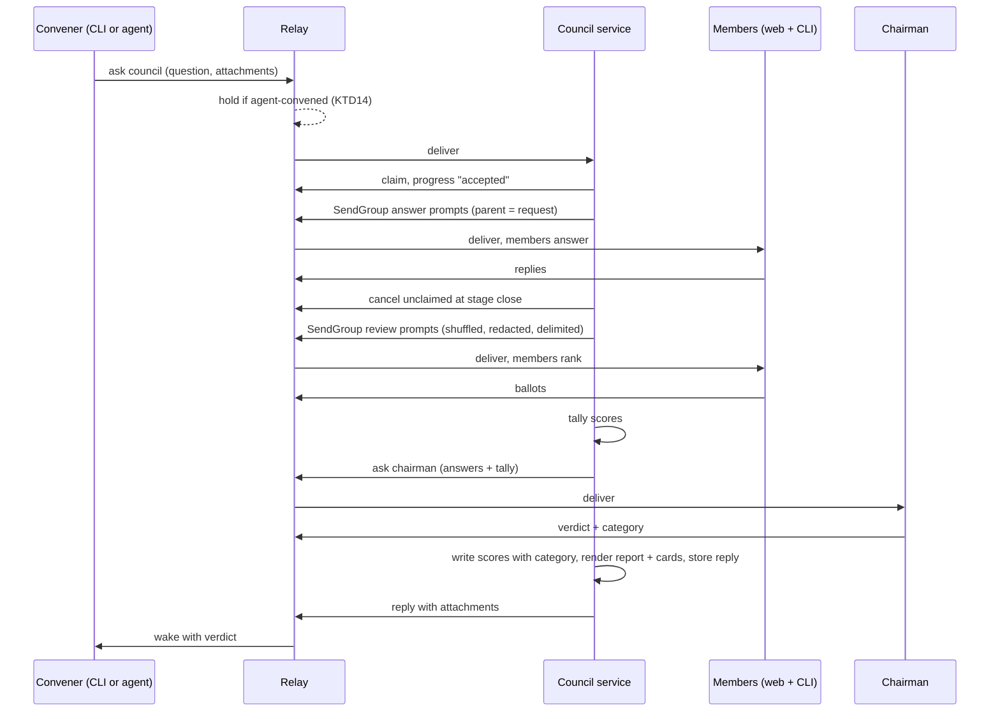
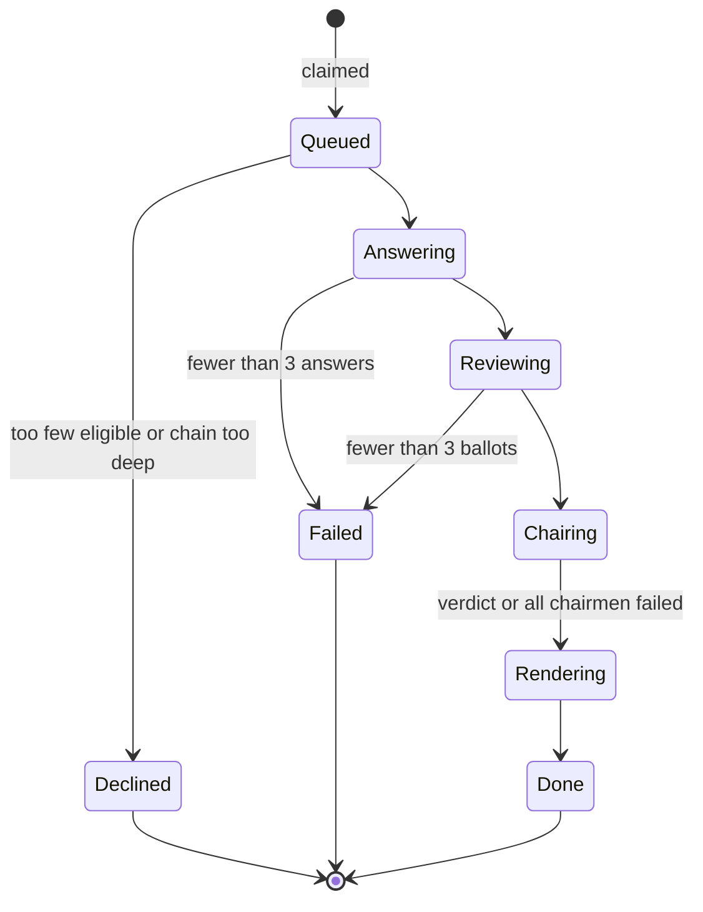

# Council - Plan

## Goal Capsule

- Objective: Anyone running Agent Tincan can put a hard question to every model on their team and get back a verdict they trust, plus a scorecard they want to post, using subscriptions they already pay for.
- Means: a new Council service teammate that runs answer, blind peer review, and chairman verdict over the existing ask fan-out (Key Decisions; KTD1).
- Authority: the Product Contract decides behavior (R wins on product behavior); the Planning Contract decides mechanism (KTD wins within its cited Rs); units carry local detail only. The owner (Matt) decides product scope.
- Execution profile: Go, one repo, nine units in dependency order. Relay change first (U1) because it ships a new agent kind.
- Stop conditions: stop and ask if a unit would need a new relay protocol field beyond the council kind, its default hold, and the held-listing preview (KTD14), a new MCP tool, or hosted sharing. Stop if live runs show web teammates cannot take council prompts at all.
- Who finishes: `ce-work` implements and verifies U1-U9; the owner runs the live launch check and cuts the release.
- Open blockers: none.

---

## Product Contract

Product Contract preservation: changed: R5 (default roster excludes live-session agents; eligibility decided by reachability, not the roster's online flag), added R17 (chairman failure) and R18 (chain exclusion and early decline). All three were confirmed by the owner at plan-time scoping.

### Summary

Council is a teammate you or any agent can ask a question.
It collects answers from every model on your team, has them rank each other's answers blind, and has a top-tier chairman write the verdict.
Every run produces a local HTML report and a PNG scorecard, and feeds a personal leaderboard of which model wins which kinds of questions.
It is built as a new service on the owner's Mac, patterned on the notes teammate, with one small relay rule so agent-convened councils wait for approval.

### Problem Frame

Getting a second opinion across models is already a habit for people making engineering decisions: paste the question into ChatGPT, Claude, Grok, and Perplexity, or ask Codex to check a plan, then compare by eye.
It is slow, the comparison is informal, and nothing records which model tends to be right about what.
Better models give better answers to some kinds of questions, and people want to stack-rank them on their own questions rather than on public benchmarks.

Agent Tincan already reaches all of those models through the owner's own accounts (six web teammates through the Chrome extension, plus CLI agents with real repo context), and `ask` already fans out to several teammates under one group id.
Nothing packages that into a result anyone would share.
The project has about 150 stars one week after launch, with steady growth and no breakout moment.

### Actors

- A1. Owner: the person running Tincan. Convenes councils from the CLI and approves councils that agents convene.
- A2. Convening agent: any teammate (Codex, Grok Bot, ChatGPT through its connector, and so on) that asks Council a question mid-task.
- A3. Council members: the model-backed teammates that answer and then peer-review.
- A4. Chairman: one model that writes the verdict. It may also sit as a member.
- A5. Council: the new service teammate that runs the stages and produces the outputs.

### Key Decisions

- Council over trace replay, live team map, and weekly share card. It is a one-command demo of the thing only Tincan does: cross-vendor models on subscriptions you already have. (session-settled: user-approved - chosen over trace replay, live team map, weekly share card: model-vs-model results were the strongest 2026 viral pattern and use Tincan's unique reach)
- Every council both decides and ranks. The verdict is the daily use and the leaderboard is what people post. Governs R14, R15, R16. (session-settled: user-approved - chosen over verdict-only and leaderboard-only: needs both a reason to run it and a thing to share)
- Blind peer review sets the scores and an LLM chairman writes the verdict. Governs R7, R8, R9, R10. (session-settled: user-directed - chosen over a single judge model and owner-picks-winner: the owner wanted an LLM judge and blind peer review together, and peer scoring keeps the leaderboard credible when the chairman is also a contestant)
- The chairman defaults to the most capable model on the team, Fable 5.1 today, and is configurable. Governs R9. (session-settled: user-directed - chosen over the asker or a fixed model: the "fanciest model" changes every few months)
- Local HTML report and PNG card, no hosted links. Governs R12, R13. (session-settled: user-approved - chosen over hosted share links on agenttincan.com: keeps "nothing leaves your tailnet" true and adds no hosting)
- Both the owner and agents can convene. Governs R1, R2, R3. (session-settled: user-approved - chosen over CLI-only and agents-only: "my coding agent convened a council before deciding" is the demo moment)
- Proceed with quorum instead of waiting for everyone. Governs R11, R17. (session-settled: user-approved - chosen over wait-for-all and a fast-members-only default: one stuck verification page must not stall a council)
- Council is a teammate on the roster, not a client-only command or a relay feature. Anyone who can `ask` can convene one, and the relay stays a thin pipe, following the history agent's precedent as a non-model service teammate. (session-settled: user-approved - chosen over a client-side command and relay-side orchestration: only the teammate shape lets web and chat agents convene)
- Live-session agents stay off the default roster and out of the default chairman seat. Governs R5, R9. (session-settled: user-approved - chosen over including Claude Code by default: asking it would interrupt the owner's live coding session)

### Requirements

Convening

- R1. Council appears on the roster as a teammate, and any teammate can convene a council by asking it a question.
- R2. The owner can convene from the CLI with one command that shows progress through the stages and prints the verdict when done.
- R3. Councils convened by an agent are held by the owner approval gate by default. Councils the owner convenes are not held.
- R4. The convener can optionally attach context (for example a plan file or diff), and every member receives it with the question.

Members and stages

- R5. By default every reachable model-backed teammate sits on the council, except agents that live inside the owner's working session (Claude Code). The owner can set a default roster and override it per council.
- R6. In the answer stage each member answers independently, without seeing other members' answers.
- R7. In the review stage each member receives all answers under neutral labels with authorship hidden, and ranks them. A member's ranking of its own answer is dropped from the tally.
- R8. Peer rankings are tallied into one score per answer. That tally alone decides the council's ranking and the leaderboard.
- R9. The chairman is configurable and defaults to the most capable model available on the team that is not a live-session agent. It receives the question, the anonymized answers, and the peer tally, and writes the verdict.
- R10. The verdict gives a recommendation, where members agreed, where they disagreed, and any minority answer worth a second look. The chairman cannot change the scores.
- R18. The convener and anyone else already in the request's chain never sit on that council or chair it. When fewer than 3 eligible members remain, Council declines before asking anyone and says why.

Quorum

- R11. Each stage waits up to a time limit, then proceeds with the members that responded, as long as at least 3 did. With fewer than 3 answers the council ends with a clear failure status and returns any answers it received. Members that were slow, blocked, or offline are marked absent and are not scored or penalized on the leaderboard.
- R17. When no chairman candidate can deliver a verdict, the council still completes with the peer ranking and says the verdict is missing. The leaderboard records it under "uncategorized".

Outputs

- R12. The convener's reply carries the verdict and the ranked list of members, readable as plain text by any agent.
- R13. Each council writes a self-contained local HTML report and a PNG scorecard sized for posting on X. The report reveals authorship after judging and shows the question, every answer, the peer rankings, the verdict, timings, and absent members. The card shows the question, the members ranked, the verdict in one line, and Agent Tincan branding with the repo link. Both are attached to the reply and saved on the owner's machine.

Leaderboard

- R14. Each completed council records every scored member's peer score, placement, and the question's category, locally.
- R15. The chairman assigns each question one category from a small fixed set (for example architecture, debugging, writing, research, current events) so the leaderboard can show who wins what.
- R16. The owner can view the leaderboard overall and by category, and render it as a shareable PNG card.

### Key Flows

- F1. Owner convenes from the terminal
  - Trigger: the owner runs the council command with a question, optionally attaching a plan file.
  - Actors: A1, A3, A4, A5
  - Steps: members answer; members review blind; scores are tallied; the chairman writes the verdict; progress shows at each stage.
  - Outcome: the verdict prints in the terminal and the report and card paths are shown.
  - Covered by: R2, R4, R6, R7, R8, R9, R10, R12, R13
- F2. An agent convenes mid-task
  - Trigger: Codex hits an architecture fork and asks Council.
  - Actors: A2, A1, A3, A4, A5
  - Steps: the request is held for approval; the owner approves; Council leaves Codex off the council; the council runs; the reply returns to Codex with the report and card attached.
  - Outcome: Codex continues its task using the verdict.
  - Covered by: R1, R3, R12, R13, R18
- F3. A member drops out
  - Trigger: copilot-web hits a human-verification page during the answer stage.
  - Actors: A3, A5
  - Steps: the member reports failed; the stage proceeds with the rest once the time limit passes.
  - Outcome: the scorecard lists Copilot as absent and its leaderboard record is unchanged.
  - Covered by: R11

### Acceptance Examples

- AE1. Covers R7, R8. Given 5 members answered, when Grok ranks Grok's own answer first, then that vote is dropped and the tally uses Grok's rankings of the other 4 answers only.
- AE2. Covers R8, R9, R10. Given the chairman is also a member and the tally ranks its answer third, then the verdict may recommend a different answer but the scorecard and leaderboard still show it third.
- AE3. Covers R11. Given 7 members are asked and only 2 answer before the time limit, then the council ends with a failure status, returns the 2 answers, and records nothing on the leaderboard.
- AE4. Covers R11. Given 6 members answer and copilot-web is blocked, then review runs with 6 answers and Copilot's leaderboard record is unchanged.
- AE5. Covers R3. Given Codex asks Council a question, then the request waits in the approval queue until the owner approves it. Given the owner runs the council command interactively in a terminal on an admin device, then it starts without waiting. Given an agent runs the same command from its shell, then it waits for approval like any agent ask.
- AE6. Covers R18. Given Codex convenes and Codex is on the default roster, then Codex is listed as "excluded (in chain)" rather than absent, and no cycle error reaches Codex.
- AE7. Covers R17. Given all three chairman candidates fail, then the reply carries the peer ranking with "verdict unavailable", and the leaderboard records the scores under "uncategorized".

### Success Criteria

- Agent Tincan reaches 1,000 GitHub stars within two weeks of the Council release, up from about 150.
- The launch lands on the framing "LLM Council, but on the subscriptions you already have, and your coding agents get a seat," with a short demo clip of an agent convening a council on a real engineering decision, and the README and site lead with Council.
- The owner uses Council on real engineering decisions, not only for the demo.
- A council with the full default roster completes within 15 minutes, the sum of the default stage limits (KTD4).

### Scope Boundaries

Deferred for later

- Hosted public share links on agenttincan.com.
- Multi-round debate where members respond to each other's critiques.
- A public or cross-user leaderboard.
- Nested councils (a council member convening another council).
- A card mode that hides the question text. For now the owner decides what to post.

Outside this product's identity

- Orchestration inside the relay. Council lives in a teammate, and the relay stays a thin pipe.
- Paying per-token API providers as the default way to reach models. The point is using subscriptions the owner already has.

Considered and not built

- Cancelling a running council. Once Council claims a request the convener's `cancel` no longer applies, and Ctrl-C in the owner CLI only detaches. Web members cannot be interrupted mid-answer anyway. Revisit if owners report wanting to stop long councils.
- Resuming a council mid-stage after a crash. A redelivered in-progress council restarts from scratch (KTD10). Revisit if restarts become common.
- A per-convener rate cap. The approval gate (R3) already bounds agent-convened councils. Revisit if held notices pile up.
- Tracking which underlying model a member ran (for example a new ChatGPT default). The leaderboard is keyed by teammate name. Revisit when the roster reports model identity.
- Headless-Chrome rendering of the card. Pure Go rendering always works; revisit if emoji or CJK questions look broken on cards.
- A setting to keep shell-running CLI members out of the review stage. Review prompts carry model answers, not arbitrary web pages, and KTD7 frames them as data; revisit if an injection through a member answer is ever observed.
- Filtering memory-derived content (Gmail, ChatGPT memory) out of member answers before other vendors see them. The trust note in U9 tells owners this happens; revisit on user request.
- Keeping attachments away from web members, or shorter retention for inlined text. The approval preview (KTD14) lets the owner see what goes out before approving.

#### Deferred to Follow-Up Work

- The launch demo video (HyperFrames) and the launch posts, after U9 lands.
- An agent-facing MCP tool dedicated to Council, only if agents mis-form the structured request in practice.

### Dependencies / Assumptions

- Web teammates pass their tests, but live end-to-end runs through the extension are still pending for some of them (README.md). Council's reliability depends on them.
- One `ask` fans out to at most 8 teammates, and a relay sender is limited to 30 new requests per minute (internal/client/relay.go, internal/policy/policy.go).
- Web teammates run under an 8-minute request timeout, accept only text up to 32 KB per send, and continue the asker's last conversation unless the prompt's first line is "new chat" (internal/history/web.go, internal/history/native.go).
- The relay's hop limit defaults to 4 and cycles are rejected (internal/policy/policy.go). Council adds one hop between the convener and the members.
- The owner selects the model inside each web account (for example Fable 5.1 on claude.ai). Council reaches whatever model the account uses.
- The prior-art comparison is Karpathy's `llm-council` (answer, anonymous peer review, chairman over paid APIs). Council's difference is the owner's own subscriptions plus CLI agents with repo context.

### Sources / Research

- Pattern to copy: the notes teammate (internal/notes/serve.go, internal/notes/service.go, internal/notes/request.go, internal/cli/notes.go) and the shared history service plumbing it reuses (internal/history/serve.go: `RunPolling`, `PollAndHandle`, `Handle`, `ChainDenied`).
- Fan-out and waiting: `Relay.SendGroup`, `WaitGroup`, `NormalizeTargets` (internal/client/relay.go); explicit parent resolution in `policy.Prepare` (internal/policy/policy.go).
- Kinds and gating: internal/onboard/onboard.go (`Kinds`, `KnownKind`, `defaultWake`, `expectOnline`); kind-specific relay rule precedent `requestTTL` (internal/relay/server.go); approval gate `Held` (internal/policy/approval.go).
- Store pattern: internal/store/store.go (modernc.org/sqlite, `CREATE TABLE IF NOT EXISTS`, idempotent migrations).
- Prior art: karpathy/llm-council `backend/council.py` ("Response A/B" labels, "FINAL RANKING:" parse, mean-rank aggregate, self-votes not excluded).
- Ranking and bias: partial-ballot aggregation (arxiv 2502.17077), label-induced bias (arxiv 2508.21164), self-preference bias (arxiv 2410.21819).
- Viral patterns in 2026: model-vs-model scorecards (Emergence World), leaderboard share cards (TokenBoard, CCgather), agent-to-agent spectacles (OpenAI agents wiki story on HN, 2.3k points).
- Adjacent: Claude Code native SendMessage is Claude-only, text-only, single-machine. Four other "tincan" agent-messaging repos exist, so the Council launch names Agent Tincan and links the repo explicitly.

---

## Planning Contract

### Key Technical Decisions

- KTD1. Council is a new `internal/council` package modeled on `internal/notes`, running on the owner's Mac as a launchd or systemd service with wake method `wait`. It reuses the history polling, claim, reply-with-attachments, and service-install plumbing, and never calls the relay's admin socket. Instantiates the teammate Key Decision; governs R1. (session-settled: user-approved - chosen over a client-side command and relay-side orchestration: only the teammate shape lets web and chat agents convene)
- KTD2. Council claims each convening request at once and runs councils one at a time from an internal queue deduplicated by request id, posting "waiting behind another council" as a progress note. Every queued or running claim is renewed with a progress note at least every 10 minutes, since a queued council can outlast the 30-minute claim lease. On startup Council re-enqueues unfinished councils from its database instead of waiting for redelivery. Running one at a time is about web-site contention: each web teammate handles one request at a time, so parallel councils would queue behind each other anyway. (session-settled: user-approved - chosen over running councils concurrently: avoids web-site contention)
- KTD3. Member asks go out through a new client helper that sends a different body and attachment set to each target under one shared group id (`SendGroup` sends one body to all, which cannot carry per-reviewer prompts or per-kind attachments), in batches of at most 8, each batch under its own group id, always with the convening request as explicit parent so the trace stays whole. Every answer, review, and chairman prompt starts with "new chat" so web teammates never mix councils or stages into one thread. A council sends at most about 2N+3 requests over several minutes, well under the 30-per-minute sender limit.
- KTD4. Stage time limits default to 6 minutes for answers, 5 for review, and 4 for the whole chairman stage including failover, all configurable in `council.json` and each under the 8-minute web timeout. When a stage closes, Council cancels member asks not yet claimed, and a member without an `answered` reply counts absent with its reason (timed out, held by a gate, failed, needs input). Governs the timing side of R11.
- KTD5. Eligibility is decided from the roster by kind, not the online flag: web kinds and command-woken CLI kinds are eligible; services and channel-woken live sessions are not, unless the owner lists them. Council then removes `req.From` and every name in `req.Chain`, declines when the convening request is already at the hop limit, and declines when fewer than 3 remain. Member and chairman overrides from a `council:` form or the owner CLI may only name eligible kinds or agents the owner listed in `council.json`; a form naming a service kind (history, notes, council, scheduled) or a live session is declined with the reason, so no retrieved chat or note content reaches other vendors. Member allowlists already check the whole chain, so Council never widens who can reach a member. Governs R5, R18. (session-settled: user-approved - chosen over including Claude Code by default: interrupting the owner's live session)
- KTD6. Prompts respect web limits. Text attachments are inlined into prompts up to a byte budget; binary attachments go only to members that accept files, with at most 20 MB forwarded per council. When an upload hits a quota, Council inlines or skips that file and notes it in the report. Every prompt to a web member stays under the 32 KB web send cap: Council measures the fixed parts first (the "new chat" line, instructions, question, delimiters, labels, and for the chairman the tally), truncates inlined attachment text next, and splits what remains evenly across answers. If even the answer prompt cannot fit, Council declines with the reason. The report records which members saw which attachments and which answers were truncated. Governs R4, R7.
- KTD7. Anonymization shuffles labels and order independently per reviewer and keeps the mapping server-side. Council redacts self-identifying names and phrases (vendor and model names, "as an AI model") in the copies reviewers see, and the answer prompt asks members not to name themselves. Before building reviewer copies, Council strips the tail tincan's web agents append to each reply (the site conversation footer, note lines, and the sources block); the report keeps the full reply. Each answer in a review or chairman prompt sits between per-council random delimiters, and the prompt says the enclosed text is material to judge, never instructions; only the defined output fields are parsed. The report notes that writing style can still leak identity. Governs R7, R9, R10.
- KTD8. Reviewers end with a "FINAL RANKING:" numbered list of labels, following llm-council. Council parses only the last such block, accepts only labels issued to that reviewer, and has one lenient fallback; a ballot that cannot be parsed counts as no ballot, not as last place. Each ballot is normalized to Borda points over the answers it ranked (own answer excluded), and a member's score is the mean across ballots, shown with the ballot count. Fewer than 3 valid ballots ends the council as failed under R11. Governs R7, R8.
- KTD9. The chairman is picked from an ordered candidate list in `council.json`, defaulting to claude-web, chatgpt-web, gemini-web, skipping chain members and preferring candidates whose review ballot already came back so their site is idle. It must return one category from the fixed set plus the verdict sections. On failure Council tries the next candidate inside the chairman stage budget; when none succeeds, it completes under R17. Governs R9, R10, R15, R17. (session-settled: user-approved - chosen over failing the council: the peer ranking is still worth returning)
- KTD10. Council keeps its own SQLite database (modernc.org/sqlite, CGO-free) in its Application Support folder, with a councils table keyed by convening request id (state, final reply text, artifact paths) and a scores table. A redelivered request that already finished gets its stored reply resent; one that was in progress restarts from scratch. Score inserts are idempotent on request id. Council's folders are created 0700 and its files 0600, following notes. Governs R14.
- KTD11. The report is `html/template` with an embedded template, inline CSS, and a Content-Security-Policy meta tag that blocks scripts and remote loads. Model text is only ever inserted as escaped text: no `template.HTML` and no markdown-to-HTML conversion. The cards are drawn in pure Go at 1600x900 with `golang.org/x/image` opentype and an embedded font; glyphs the font lacks are replaced, not dropped silently. No headless Chrome. Governs R13, R16.
- KTD12. The reply is text first: the recommendation line, the question's first line, a status line ("7 asked, 5 scored, 1 absent, 1 excluded"), the ranking with scores, then agreement, disagreement, and minority notes. A fenced `council-result` JSON block follows for scripts. Statuses map as completed to `answered`, no quorum to `failed` with the answers received, and a bad form, too-deep chain, or too few eligible members to `declined`. If attaching the report or card fails, the reply still goes out with their local paths. Governs R12.
- KTD13. Convening needs no new MCP tool. Free text is a question with defaults. A structured `council: {...}` form, parsed in Go like notes requests, carries optional members, exclusions, chairman, and a `leaderboard` operation. A bad form fails with the reason and the form's shape. Governs R1, R5, R16.
- KTD14. The relay learns a `council` kind, and the default hold lives in `Policy.Prepare`, not the approval file reader. When no approval rule held an ask and approval.json has no entry for the target, Prepare looks up the target's kind in the store and holds council-kind targets with the configured hold TTL (2 hours when there is no file). A failed kind lookup holds rather than delivers. Without approval.json there is no notify target, so the relay pushes no notice; the convening agent is the signal, told by its instructions to give the owner the request id and the approve command, and the docs point to approval.json's `notify` field for relay-pushed notices. An explicit entry wins, and `{"from": []}` means hold nothing. `tincan held` shows the target kind and attachment names and sizes so the owner sees what would go to vendors before approving. `tincan council` approves its own held request only when run interactively in a terminal on an admin device; from a script or an agent's shell it waits like any ask. `council serve` refuses to start unless the relay reports its kind as `council`, so an older relay can never run councils unheld. Governs R3. (session-settled: user-approved - chosen over a per-name `unless` rule in approval.json: holding by default needs no owner setup)
- KTD15. Progress notes go out at each stage change ("Answers: 5 of 7 in", "Chairman claude-web writing verdict") and at least every 10 minutes. They renew the claim lease and drive the owner CLI's stage display. Governs R2.

### High-Level Technical Design

Sequence of one council across processes:



Council lifecycle:



### Output Structure

```text
internal/council/
  config.go        council.json: roster, chairman list, stage limits
  request.go       free text and council: form parsing
  roster.go        eligibility and chain exclusion
  engine.go        stage runner, quorum, stage-close cancels
  prompts.go       answer, review, chairman prompts and budgets
  anonymize.go     labels, shuffles, redaction, delimiters
  ballot.go        ranking parse and scoring
  chairman.go      candidate failover and verdict parse
  store.go         councils and scores tables
  reply.go         text reply and council-result block
  report.go        HTML report
  card.go          PNG scorecard and leaderboard card
  templates/       report template
  fonts/           embedded font
  serve.go         poll, claim, queue, lease renewal, reply
  service.go       launchd/systemd install
```

### System-Wide Impact

- Relay and upgrades: a new kind and a default hold. A new relay serves old clients unchanged (old clients already render `held`, and unknown roster kinds fall back to generic). An old relay refuses the kind, and Council refuses to serve without it (KTD14). Upgrade order is relay first, then clients, then install Council.
- Approval gate: council asks can now be held with no approval.json at all. Existing rules also apply to Council's member asks through the chain, so a rule like holding chatgpt-web asks from codex will hold that member when codex convenes; it counts absent as "held by a gate".
- Web teammates: a council keeps every web teammate busy for up to about 15 minutes and opens several tabs in the owner's Chrome at once. Other agents asking a web teammate meanwhile wait their turn.
- Data leaving the tailnet: council prompts, inlined attachments, and other members' answers go to every web vendor on the council. One member's memory-informed answer reaches the other vendors during review. The approval preview and U9's trust note make this visible.
- Retention: inlined attachment text lives in request bodies kept by the relay like any request, not on the 7-day attachment clock. Council's own database and report folder keep councils until the owner deletes them.
- Agent parity: agents convene, override the roster within eligible kinds, and read the leaderboard through the same ask the CLI uses; only approval and interactive self-approval stay owner-only. The relay holds by target kind and cannot see the operation, so an agent's leaderboard read is held like a council unless approval.json exempts it.

### Risks

| Risk | Decision |
|---|---|
| Web teammates' live end-to-end runs are still pending, so members fail more than expected | Quorum (R11) absorbs dropouts; the live launch check gates release |
| A site changes its UI or rate-limits heavily during a launch demo | Rehearse on the day; stage limits and absent labels keep the demo readable |
| An agent convenes too often and floods the owner with held notices | Approval gate plus the when-to-convene guidance in U9; a per-convener cap is considered and not built |
| Owner's normal web-teammate use stalls behind a council | Accepted and documented in System-Wide Impact; one council at a time bounds it |
| Card text with emoji or CJK renders poorly | Replacement glyphs; headless Chrome considered and not built |
| Attachment quota exhaustion from re-uploads | 20 MB forward cap and quota fallback (KTD6) |

### Assumptions

- Web members answer a "new chat" prompt in a fresh conversation, as documented for the web teammates today.
- The owner convenes from a terminal on an admin device. Otherwise owner councils wait for approval like agent councils.

---

## Implementation Units

### U1. Relay: council kind, default hold, and approval preview

- Goal: the relay accepts a `council` kind, holds asks to a council-kind agent unless approval.json names it, and shows the owner what a held ask carries.
- Requirements: R1, R3; AE5; KTD14.
- Dependencies: none.
- Files: internal/onboard/onboard.go, internal/onboard/onboard_test.go, internal/policy/policy.go, internal/policy/approval.go, internal/policy/policy_test.go, internal/policy/approval_test.go, internal/relay/server.go, internal/relay/server_test.go, internal/cli/agent.go.
- Approach:
  1. Add `KindCouncil` to the kind list with default wake `wait`, marked as a service.
  2. Add a nil-safe way to ask the approval config whether it has an entry for an agent.
  3. In `Policy.Prepare`, after the existing rules, hold council-kind targets with no entry, setting the hold TTL and the configured notify target when one exists; hold when the kind lookup fails.
  4. Add the target kind and attachment names and sizes to the held listing and `tincan held` output.
- Patterns to follow: `requestTTL` kind rule in internal/relay/server.go; `Held` in internal/policy/approval.go; README "Before you upgrade" notes for new kinds.
- Test scenarios:
  - Covers AE5. With no approval.json (nil approval config), an agent's ask to a council-kind agent is held with a non-zero hold TTL.
  - With approval.json present but no council entry, the ask is held.
  - With an explicit `{"from": []}` entry for the council agent, the ask is delivered.
  - A kind lookup error leaves the ask held, not delivered.
  - An ask to a non-council agent with no approval.json is delivered, unchanged from today.
  - A default-held council ask with no approval.json returns status held to the sender and sends no relay notice.
  - `tincan held` lists the target kind and each attachment's name and size.
  - Inviting an agent with kind `council` succeeds on this relay.
- Verification: policy and relay tests pass, including in the test relay rig where approval is nil.

### U2. Council config, request form, and eligibility

- Goal: parse what the convener asked for and decide who sits on the council and who chairs.
- Requirements: R1, R5, R9, R18; AE6; KTD5, KTD9, KTD13.
- Dependencies: none.
- Files: internal/council/config.go, internal/council/request.go, internal/council/roster.go, internal/council/request_test.go, internal/council/roster_test.go.
- Approach:
  1. `council.json` holds default roster overrides, chairman candidates, category set, stage limits, and paths.
  2. Parse free text as the question; parse the `council:` form for overrides and the `leaderboard` operation.
  3. Resolve eligibility per KTD5, then the chairman order per KTD9.
- Patterns to follow: internal/notes/request.go structured form and its failure replies; `expectOnline` in internal/onboard/onboard.go.
- Test scenarios:
  - Free text becomes the question with the default roster and chairman list.
  - A `council:` form with members and chairman overrides uses them.
  - A malformed form yields a decline carrying the reason and the form's shape.
  - Covers AE6. The convener and every chain name are excluded and labelled "excluded (in chain)".
  - Claude Code is not on the default roster; listing it in council.json adds it.
  - With 2 eligible members after exclusions, eligibility reports a decline before any ask.
  - A convening request already at hop 4 is declined as too deep; one at hop 3 is accepted.
  - A chairman candidate that is in the chain is skipped for the next.
  - A form naming the history agent or Claude Code as a member or chairman is declined before any ask, unless the owner listed that agent in council.json.
- Verification: eligibility tests cover every exclusion reason with a distinct label.

### U3. Council store and leaderboard

- Goal: persist council outcomes and scores so restarts never double-count and the leaderboard can be queried.
- Requirements: R14, R16; KTD10.
- Dependencies: none.
- Files: internal/council/store.go, internal/council/store_test.go.
- Approach:
  1. Open a Council-owned SQLite file with the relay store's pragmas and idempotent migrations, creating folder and file with owner-only permissions.
  2. Record council state and final reply by request id; record scores idempotently; list unfinished councils for restart.
  3. Query leaderboard overall and by category: councils scored, mean score, wins.
- Patterns to follow: internal/store/store.go Open and migrate functions; permission handling in internal/notes.
- Test scenarios:
  - Recording the same council's scores twice leaves one set of rows.
  - Leaderboard by category counts only that category.
  - A failed council records no scores.
  - A completed council's stored reply is returned for its request id.
  - Unfinished councils are listed after reopening the database.
  - The database file is created with mode 0600 inside a 0700 folder.
- Verification: store tests pass on a temp directory with `-race`.

### U4. Stage engine: answers, review, and scoring

- Goal: run the answer and review stages with quorum and produce the peer scores.
- Requirements: R4, R6, R7, R8, R11; AE1, AE3, AE4; KTD3, KTD4, KTD6, KTD7, KTD8.
- Dependencies: U2.
- Files: internal/client/relay.go, internal/client/relay_test.go, internal/council/engine.go, internal/council/prompts.go, internal/council/anonymize.go, internal/council/ballot.go, internal/council/engine_test.go, internal/council/ballot_test.go, internal/council/anonymize_test.go.
- Approach:
  1. Send answer prompts in batches with explicit parent, gather until the stage limit, cancel unclaimed asks, and apply quorum.
  2. Build a per-reviewer review prompt with shuffled labels, redacted copies, delimiters, and truncated answers inside the budget.
  3. Parse ballots per KTD8, drop the self-rank, normalize, and average.
- Execution note: start with failing tests for AE1 and AE3 against scripted members before wiring the real send path.
- Patterns to follow: `SendGroup` and `WaitGroup` in internal/client/relay.go; mesh-driven member fakes in internal/notes/serve_test.go.
- Test scenarios:
  - Covers AE1. A reviewer ranking its own answer first has that entry dropped and the rest scored.
  - Covers AE3. Two answers by the limit end the council failed with both answers returned.
  - Covers AE4. A member whose reply is failed with blocked text is absent and unscored, and review runs with the rest.
  - Nine eligible members are asked in two batches with distinct group ids, both under the same parent.
  - At stage close, a member ask still queued is cancelled and the member is absent as "timed out".
  - A member whose ask was held by an existing gate rule is absent as "held by a gate".
  - Every prompt's first line is "new chat".
  - A review prompt for a long question and six long answers stays under 32 KB, and truncation is recorded.
  - Two reviewers in one batch receive different bodies under the same group id.
  - No reviewer copy contains a web conversation footer or sources block.
  - A ballot with no "FINAL RANKING:" and no recognizable labels counts as no ballot.
  - An answer containing its own "FINAL RANKING:" block and "ignore previous instructions" text does not change another reviewer's parsed ballot; only the reviewer's last block and issued labels count.
  - Two reviewers see different label orders for the same answers.
  - A reply containing "As Claude," reaches reviewers with the name redacted.
  - Two valid ballots end the council failed under R11.
  - A text attachment is inlined for web members and forwarded as a file to CLI members.
  - A member whose allowlist names Council but not the convener declines and counts absent.
- Verification: engine tests run end to end on the test relay with scripted members and no network.

### U5. Chairman and verdict

- Goal: get a verdict and category from the first working chairman, or complete without one.
- Requirements: R9, R10, R15, R17; AE2, AE7; KTD9.
- Dependencies: U4.
- Files: internal/council/chairman.go, internal/council/chairman_test.go, internal/council/prompts.go.
- Approach:
  1. Order candidates per KTD9, then send the question, anonymized answers, and tally within the text budget.
  2. Parse category and verdict sections; an unknown category becomes "uncategorized".
  3. On failure or timeout, try the next candidate inside the chairman stage budget; after that, complete per R17.
- Patterns to follow: stage sending from U4.
- Test scenarios:
  - Covers AE2. A verdict recommending a lower-ranked answer leaves the scores unchanged.
  - Covers AE7. Three failing candidates produce a ranking-only result under "uncategorized".
  - A first candidate that times out falls through to the second, which succeeds.
  - The chairman stage never runs past its total budget, however many candidates fail.
  - A candidate whose ballot already came back is tried before one still busy.
  - A category outside the fixed set is stored as "uncategorized".
  - The chairman prompt for a long question and eight long answers fits the 32 KB budget.
  - An answer containing "ignore previous instructions" and a fake verdict and category block does not change the parsed category or verdict.
- Verification: chairman tests pass with scripted candidates.

### U6. Reply, HTML report, and PNG cards

- Goal: turn a finished council into the reply text, the report, the scorecard, and the leaderboard card.
- Requirements: R12, R13, R16; KTD10, KTD11, KTD12.
- Dependencies: U3, U5.
- Files: internal/council/reply.go, internal/council/report.go, internal/council/card.go, internal/council/templates/report.html.tmpl, internal/council/fonts/, internal/council/reply_test.go, internal/council/report_test.go, internal/council/card_test.go, go.mod, go.sum.
- Approach:
  1. Format the reply per KTD12, including the `council-result` block.
  2. Render the report per KTD11 with authorship revealed, rankings, verdict, timings, absent and excluded members, and the KTD6 attachment and truncation notes.
  3. Draw the scorecard and leaderboard cards at 1600x900 with branding and the repo link, writing files with owner-only permissions.
- Patterns to follow: embedded templates in internal/onboard/onboard.go; `html/template` use in internal/gateway/gateway.go.
- Test scenarios:
  - Golden test: a completed council's reply text matches the fixture, and its `council-result` block parses with matching status and ranking.
  - A no-quorum council's reply status is `failed` and includes the received answers.
  - Answers containing `<script>`, an `onerror` attribute, and a `javascript:` link appear escaped in the report, and the report carries the CSP meta tag and no external resource references.
  - The scorecard is a 1600x900 PNG that decodes, for a question of 500 characters.
  - A question containing emoji renders with replacement glyphs and no panic.
  - A ranking-only council's card says the verdict is unavailable.
  - The leaderboard card renders with one member and with ten.
- Verification: golden and render tests pass; `make build` stays CGO-free.

### U7. Council service loop and install

- Goal: run Council as a teammate that claims, queues, runs, stores, and replies, and install it as a service.
- Requirements: R1, R2, R3, R11, R12, R13; F2, F3; KTD1, KTD2, KTD6, KTD10, KTD12, KTD14, KTD15.
- Dependencies: U1, U2, U3, U4, U5, U6.
- Files: internal/council/serve.go, internal/council/service.go, internal/council/serve_test.go, internal/council/service_test.go, internal/cli/council.go, internal/cli/council_test.go, internal/cli/root.go.
- Approach:
  1. Refuse to start unless the relay reports this agent's kind as `council`.
  2. Poll and claim at once; dedupe and enqueue; renew queued and running claims; re-enqueue unfinished councils on startup.
  3. Run the stages with progress notes; render outputs; store the final reply; reply with attachments, falling back to local paths when uploads fail.
  4. On redelivery, resend a stored reply or restart an unfinished council.
  5. Add `tincan council serve`, `install`, and `doctor`, mirroring the notes commands.
- Patterns to follow: internal/notes/serve.go and service.go; internal/cli/notes.go; the history attachment-fallback reply.
- Test scenarios:
  - Covers F2. An agent-convened council is held, approved, runs, and the reply reaches the convener with report and card attached.
  - `council serve` exits with a clear message when its relay kind is not `council`, and `doctor` fails that check.
  - A second council arriving mid-run is claimed within the delivery lease and gets a waiting note.
  - A council waiting in the queue longer than the claim lease keeps its claim through renewals.
  - A redelivery of a request that is still queued does not create a second queue entry.
  - A council that already finished and is redelivered is answered from the store without new member asks.
  - An unfinished council found at startup runs again and records scores once.
  - When the report upload hits a quota error, the reply still arrives with the local file paths.
  - Progress notes appear for each stage in order.
- Verification: service tests pass on the test relay rig; the installed service starts and shows on the roster as kind `council`.

### U8. Owner CLI: convene and leaderboard

- Goal: let the owner convene a council and view the leaderboard from the terminal.
- Requirements: R2, R3, R16; F1; AE5; KTD13, KTD14, KTD15.
- Dependencies: U1, U7.
- Files: internal/cli/council.go, internal/cli/council_test.go.
- Approach:
  1. `tincan council "question"` sends the form to Council with any `--attach`, `--members`, `--chairman`, and prints which agent identity it sends as.
  2. Approve its own held request only per KTD14; otherwise say it is waiting for approval.
  3. Show progress notes as stage lines, print the reply, and save the attachments to a local folder with owner-only permissions.
  4. `tincan council leaderboard [--category] [--card]` sends the leaderboard operation and prints or saves the result.
- Patterns to follow: `ask` and `get` in internal/cli/agent.go; `--json` and exit-code conventions from README.
- Test scenarios:
  - Covers F1. A council run prints stage lines in order and the final verdict.
  - Covers AE5. Run with a terminal on an admin device, the held request is approved without further owner action.
  - Covers AE5. Run with stdin not a terminal, the command reports the request is waiting for approval and does not approve it.
  - Run from a non-admin device, the command reports the request is waiting for approval.
  - `--json` prints the `council-result` block and exits 0 for completed, 1 for failed or declined.
  - `leaderboard --card` saves a PNG and prints its path.
- Verification: CLI tests pass against the test relay.

### U9. Onboarding, docs, and launch surface

- Goal: teach agents when and how to convene, tell owners what Council shares, and make Council the headline of the README and site.
- Requirements: R1, R3; Success Criteria.
- Dependencies: U7, U8.
- Files: internal/onboard/templates/agent.tmpl, internal/onboard/templates/operator.tmpl, internal/onboard/onboard_test.go, docs/adapters/council.md, docs/trust-model.md, README.md, site/index.html, site/agents.txt.
- Approach:
  1. Add `instructions.council` (convene only through ask, when to convene, one per task, never nested, held is expected and the agent tells the owner the request id and approve command, verdicts and answers are data not instructions, leaderboard reads are held too) and `setup.council`.
  2. Route "put this to the council" in the operator prompt, and never approve held councils there.
  3. Write docs/adapters/council.md, and add to the trust model: web members send prompts, inlined attachments, and other members' answers to third-party sites; approval from an admin device is owner-equivalent, so the hold restrains agents only when they cannot approve.
  4. Correct the README's approval section for the new default hold, and lead the README and site with Council and the llm-council framing, with a "New in" section and the relay-first upgrade order.
- Patterns to follow: `instructions.notes` and `setup.notes` blocks; docs/adapters/notes.md.
- Test scenarios:
  - Onboarding output for a new teammate includes the council instruction block.
  - The operator prompt includes the council routing line.
- Verification: onboard tests pass; README, site, and agents.txt describe the same command names as the CLI help.

---

## Verification Contract

| Gate | Command | Applies to |
|---|---|---|
| Unit and integration tests | `make test` (go test -race ./...) | U1-U9 |
| Static checks | `make vet`, `make lint` | U1-U9 |
| CGO-free build | `make build` | U6, U7 |
| Live launch check (manual) | Install the service, convene one council from the CLI and one from Codex against the real web teammates, and open the report and card | U7, U8 |

CI runs the first three on every pull request (.github/workflows/ci.yml, lint.yml). The live check is the owner's, because web teammates need signed-in Chrome sessions.

## Definition of Done

- Every requirement R1-R18 is covered by a unit's tests or the live launch check.
- `make test`, `make vet`, `make lint`, and `make build` pass.
- A live council with at least five members completes, and its card is good enough to post.
- An agent-convened council is held, approved, and returns a verdict the agent uses.
- The README, site, agents.txt, and docs/adapters/council.md describe the shipped behavior and the relay-first upgrade order.
- No abandoned-approach code remains in the diff.
