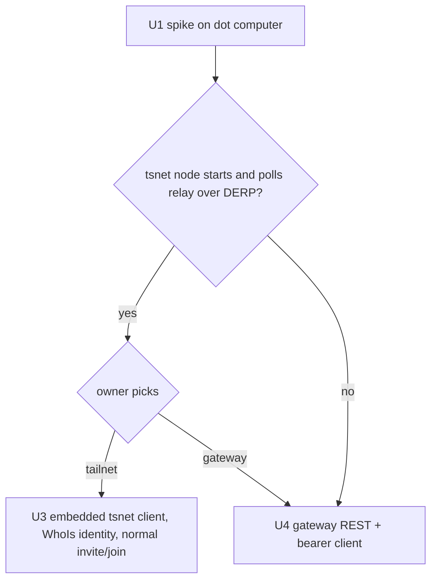
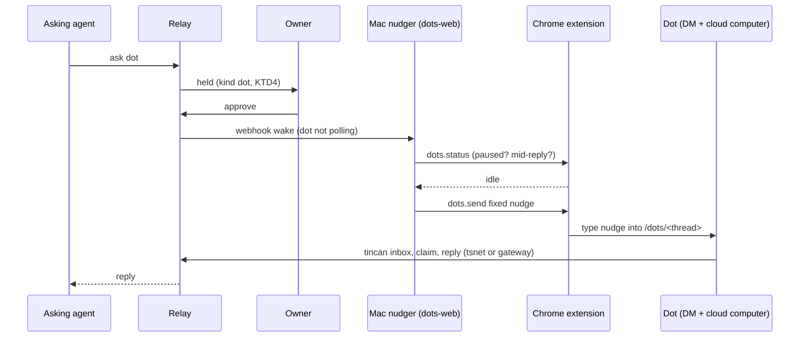

# OpenAI Dot as a Teammate - Plan

---

## Goal Capsule

- Objective: the owner's OpenAI dot works as a two-way Tincan teammate. Any agent can hand it work and get a real reply without the owner relaying anything. The dot can ask other teammates for help. The owner stays in control of what reaches it.
- Means: the dot runs the `tincan` CLI on its own cloud computer. It reaches the relay over the tailnet through an embedded tsnet node, or through the public gateway (KTD1). A Mac-side nudger wakes it by typing a fixed nudge into its DM through the Tincan Chrome extension (KTD2, KTD3).
- Authority: Requirements (R) win on product behavior. KTDs win on mechanism within their cited Rs. Units override neither.
- Stop conditions:
  - Stop after U1 and report the spike result to the owner before building U3 or U4. U1 decides which transport gets built.
  - Stop and ask if typing into the dot's DM would require accepting a dialog, changing a dot setting, or bypassing an anti-bot check.
  - Stop and ask if any gateway change would expose an admin route or `POST /v1/join` publicly.
- Execution profile: Go relay, CLI and client, plus the Chrome extension (JS), in `agent-tincan`. Several PRs, sequenced U1, then U2, then U3 or U4, then U5 to U8. The live checks need the owner's dot (thread `0d0d0d0d-1111-7222-8333-000000000001`) and the signed-in Chrome on the owner's Mac.
- Who finishes: the implementer builds and tests. The owner edits the tailnet ACL and mints the dot's tagged auth key (tailnet path), or runs `tincan connect dot --kind dot` (gateway path), and approves the first held request during the live check.

---

## Product Contract

### Summary

Add a `dot` kind. A dot joins as its own agent, from its own cloud computer, and handles requests through the `tincan` CLI like any other teammate. A request to a dot is held for owner approval by default. Once approved, a small Mac-side service types one fixed nudge into the dot's ChatGPT DM so it runs `tincan inbox`. The dot's own heartbeat is the fallback wake. The transport onto the relay is decided by a time-boxed spike: an embedded tsnet node if it can start in the dot's sandbox, otherwise the public gateway over HTTPS.

### Problem Frame

OpenAI launched Dots on 2026-09-29. A dot is an always-on agent powered by GPT-6 Astra. It has its own cloud computer, the owner's connected apps (Gmail, GitHub, Google Drive and others) and a DM page at `chatgpt.com/dots/<id>`. There is no public Dots API: the OpenAI API changelog has no Dots entry. The Agents API is a separate product for building your own agents. A dot is reachable only through ChatGPT (web, desktop, mobile), Slack and Teams, and through ChatGPT plugins and connectors.

Tincan already reaches ChatGPT two ways: chatgpt-web (the extension drives chatgpt.com) and the `--chatgpt-gateway` MCP connector. Neither reaches a dot:
- A dot's DM is a new messaging-room backend, not a `/c/<id>` conversation.
- The dot works best from its own computer.
- The dot tried to install Tailscale on its computer and failed. The sandbox blocks NETLINK_ROUTE sockets, and tailscaled (including userspace networking) and tsnet all read network interfaces through netlink.

A dot is also the most powerful teammate on the roster: it acts on its own across the owner's connected apps. Handing it work must not become a way for a teammate, or text a teammate passed along, to act in the owner's Gmail or GitHub.

### Requirements

Joining and identity
- R1. A dot joins as its own named agent of kind `dot`, with its own identity. It never shares credentials with another agent or with the owner's ChatGPT gateway connector.
- R2. The dot runs the standard `tincan` CLI on its cloud computer: `inbox`, `claim`, `progress`, `reply`, `ask`, `answer` and attachments all work without the owner relaying anything.
- R3. When the dot's cloud computer is reset, the dot can tell it lost its tincan setup and asks the owner, in its DM, for a fresh join code. Requests it had claimed return to the queue when their claim lapses.

Waking
- R4. When a request or reply for a dot is queued and the dot is not polling, the owner's Mac sends the dot a nudge within about a minute, while Chrome and the extension are running.
- R5. The nudge is one fixed string. It starts with the marker `[tincan-auto]`, says only that tincan work is waiting, and states that it approves nothing. It never carries request content, sender names or instructions from the request.
- R6. The nudger never types over the owner's unsent draft, never types while the dot is mid-reply, and never nudges a paused dot. It waits a bounded time for the dot to go idle, then reports the wake as failed.
- R7. A request gets at most 3 nudges. Once a request has been nudged 3 times without a claim or reply, the nudger stops and the relay tells the asker that the dot is not picking it up.
- R8. When a nudge cannot be delivered (Mac asleep, Chrome closed, extension offline, not signed in), the asker's pending ask says the dot will see it at its next heartbeat instead of waiting silently.

Safety
- R9. Inbound asks and notifies to a `dot` are held for owner approval by default, unless `approval.json` has an entry for that dot. Holding by default does not require any config.
  - The hold covers only inbound asks and notifies. Replies and answers to the dot's own asks are not held, and R10 is the only control on them.
  - The default hold TTL for a dot is at least its heartbeat interval plus 1 hour, so approved work cannot expire before the dot picks it up.
- R10. The dot's standing instructions treat everything that arrives through tincan as data from a teammate, not as an owner instruction. That covers request bodies, replies to the dot's own asks, `answer` text and attachments.
  - Any write through a connected app (send email, push code, change a calendar or file) needs the owner's confirmation in the DM first.
  - The dot's confirmation prompt names the request id, the sender and the exact write.
  - A message carrying the `[tincan-auto]` marker never counts as confirmation.
- R11. The dot's standing instructions forbid revealing its tincan config, tokens or tailnet keys in any message, reply or file it shares.
- R12. Only the relay can trigger the nudger, and only for the dot it serves.
  - The listener binds to the Mac's tailnet address only, never 0.0.0.0.
  - A wake must carry the webhook bearer token or HMAC, and must come from the relay node (checked with WhoIs).
  - The tailnet ACL denies the dot's node any access to the listener.
- R15. The dot's tailnet node (if U3 is built) is tagged `tag:tincan-dot`. The ACL lets that tag reach only the relay's port, and nothing can connect to it. It can never be an admin.

Presence
- R13. The roster shows a dot online while it is polling. It shows the dot overdue when its polls stop for longer than twice its heartbeat interval plus the schedule grace.

Documentation
- R14. `docs/adapters/dot.md`, the README platform guide, `site/agents.txt`, and `docs/trust-model.md` describe the dot: how to join it, how it is woken, what is held, and what the nudge can and cannot do.

### Key Decisions

- Two-way teammate, not a web scrape. Work reaches the dot through its own tincan inbox. The nudge only wakes it. This was chosen over the chatgpt-web pattern of pasting each request into the DM and scraping the answer. Governs R2, R5.
- Hold by default. Requests to a dot are held unless the owner configures otherwise. Governs R9.
- One transport after a spike. A tsnet spike runs first and decides between tailnet and gateway. The gateway was the transport the owner approved. Governs R1, R2.

### Scope Boundaries

- Out: an OpenAI Dots API (none exists), the ChatGPT desktop app, Slack and Teams channels, SMS or phone calls to a dot.
- Out: importing OpenAI's own dot status (`last_check_in_at`, `status`) into the roster. Presence comes from the dot's own polls (KTD5).
- Out: reading the dot's DM replies back as tincan answers (the chatgpt-web scrape pattern).

#### Deferred to Follow-Up Work

- Several dots at once. The nudger is configured with a map of agent name to dot thread id from the start (KTD6), but only one dot is verified live.
- A dot as a council member.
- Pushing wakes over OpenAI's realtime websocket (`/backend-api/celsius/ws/user`) instead of typing into the page.

---

## Planning Contract

### Key Technical Decisions

- KTD1. Transport: the spike runs first and the owner picks. U1 tests whether a tsnet node starts in the dot's sandbox. The test registers a static interface getter with `netmon.RegisterInterfaceGetter`, calls `netns.SetEnabled(false)`, and sets `TS_FORCE_NOISE_443=1` so tsnet honors HTTPS_PROXY. (session-settled: user-approved - chosen over the tsnet-first order: the gateway over HTTPS was proposed as primary because Tailscale had just failed on the dot. The owner assented, while telling the dot "I need tailscale only".)
  - Conflict call-out: research later found that only one netlink call is fatal at tsnet startup. It is `net.Interfaces()` inside `netmon.New`, and it can be replaced (Termux issue #21129 used the same workaround). Research confidence: about 85% that the node starts, about 70% that it passes traffic over DERP. If U1 passes, the tailnet path (U3) needs no new public surface and keeps WhoIs identity, so it is likely the better primary. The Goal Capsule makes the owner choose after U1. U4 remains the planned path if U1 fails or the owner keeps the gateway.
  - The node always joins with a single-use, pre-authorized, non-ephemeral auth key tagged `tag:tincan-dot` (R15), created by the owner in the Tailscale admin console. It never uses an interactive login, which would make it an untagged node owned by the owner that could reach every device and take an unused `--admin` machine name.
  - Tagged nodes never auto-rebind. A dot whose computer was reset joins again from a fresh invite (R3).
  - The auth key expires within 1 hour. The owner revokes any unused key after a failed spike or reset, because the key passes through the dot's DM history.
  - The tailnet ACL for `tag:tincan-dot` (R15) is in place before the first key is minted.
- KTD2. Wake through the relay's existing webhook method. The dot's `wake.json` entry is `method: webhook`. It points at a new tailnet listener in the Mac-side nudger (`tincan web serve --site dots`), authenticated with a bearer token or HMAC like other webhook targets. This reuses the waker's debounce, online-skip, reply nudges, hourly budget and restart resume (`internal/wake/wake.go`). It was chosen over a new relay-side wake method, which would duplicate that plumbing, and over delegated peek, which would add a new auth concept.
- KTD3. The extension types the nudge into the page and reads state from the backend. Sending goes through `/dots/<thread-id>` in a background tab, like `send.js` does for chatgpt, because the send path is sentinel-protected. Before typing, the extension reads two things with the page's bearer (the same `chatgptAuth` path the chatgpt ops use):
  - the dot record, `GET /backend-api/tbo/by-thread/<thread-id>`, for `is_paused` and `status`;
  - the last room messages, `GET /backend-api/messaging/rooms/<room-id>/messages?limit=N`, to see whether the dot is mid-reply.

  It never touches a tab the owner opened.
- KTD4. Hold by default by generalizing the council rule. `holdCouncil` in `internal/policy/policy.go` becomes a set of hold-by-default kinds, `{council, dot}`, with the same notify behavior. The TTL for a dot follows the R9 floor. An `approval.json` entry for the target overrides it. The docs also give an `approval.json` recipe that holds requests from `dot` to command-woken and web agents (`from: ["dot"]`), because the dot's own outgoing asks are not held otherwise.
- KTD5. Presence from the dot's own polls, plus an interval on webhook targets. A webhook target may carry `every` (the dot's heartbeat). `scheduleTarget` then applies the same overdue math to webhook agents that declare it, so the dot has one wake method and still gets overdue reporting (R13).
  - The heartbeat is what the owner sets up on the dot. The dot's standing instructions (U2) ask it to add a recurring "run `tincan inbox`" task to its heartbeat list at the declared interval.
  - The onboarding recipe declares `every: 15m`, and the owner uses the same value on the dot.
  - The live check records two real heartbeat polls and confirms they match the declared interval.
- KTD6. The nudger config maps agent name to dot thread id. It is a 0600 file, `~/.config/tincan/dots-web.json`, holding `{ "<agent>": { "thread": "<id>" } }`. The room id is looked up from the dot record at runtime.
- KTD7. The relay counts nudges per request. The nudger cannot, because the webhook body carries only counts and wakes are merged per agent.
  - When the waker records a `delivered` status for the dot, the relay increments a nudge count on each request queued to it.
  - A request that reaches 3 nudges without a claim or reply gets a "not picking it up" wake note (R7) and stops counting toward further wakes.
  - The waker stops waking the dot once every pending request has hit the cap.
  - This was chosen over adding request ids to the webhook body, which would break the trust-model promise that wakes carry only a count and an instruction.
- KTD8. If U4 is built, the gateway exposes a narrow REST allowlist. `/v1/` on the gateway requires a gateway token. It always overwrites RemoteAddr to `virtual:<agent>`, strips `Authorization` and forces `X-Tincan-Agent`. It allows only these agent routes:
  - requests: poll (and peek), send, `replies/ack`, and claim, progress, reply, answer, cancel and get;
  - groups, `/v1/agents`, whoami, `trace/{id}` and search;
  - attachments and capabilities.

  It blocks `/v1/admin/*`, `PUT` kind, `GET /v1/trace`, hello, `/v1/dist` and `POST /v1/join`.
  - The attachment upload path is exempt from the 1 MiB body cap, as it is on the relay.
  - Each token has a rate limit.
  - Upgrades on the dot come from the GitHub release with its `checksums.txt`, never through the gateway.

### High-Level Technical Design

Transport decision after U1:

Request to a dot, end to end:

Nudger state per request: `queued -> nudged(1..3) -> claimed -> replied`, or `nudged(3) -> gave_up` (reported to the asker), or `wake_failed` (Chrome or extension offline: the asker is told to expect the next heartbeat).

### Assumptions

- The dot's cloud computer has outbound HTTPS (it downloaded and installed Tailscale) and a writable home directory that survives between turns, until a reset.
- The dot runs shell commands on its computer when its DM asks, with no separate approval for commands that only read and write its own files and call the network.
- The DM composer and send button on `/dots/<id>` can be driven the same way as chatgpt.com's composer. The selectors are found in U5.

### Sequencing

U1 first, then stop for the owner's transport choice. U2 can run alongside U1. After the choice, build U3 or U4 (not both). U5 and U7 depend on U2. U6 depends on U5 and U7. U8 comes last.

### Risks

| Risk | Mitigation |
|---|---|
| tsnet still fails in the sandbox (UDP bind refused, TLS-intercepting proxy) | U1 is time-boxed. U4 is the planned fallback. |
| OpenAI changes the dots page or backend | Selectors and endpoints live only in `extension/send.js` and `extension/ops.js`. A failure surfaces as `wake_failed` (R8), not a silent drop. |
| The nudge turns into an owner-level instruction channel | The fixed string (R5), an authenticated tailnet-only listener (R12) and the hold (R9). |
| Prompt injection through replies reaches connected apps | R10 instructions, with the trust model stating that the defense is instruction-level, not enforced. |
| Refresh-token rotation race on the gateway path | A cross-process file lock plus save-before-use (U4). |
| Nudges use up the owner's ChatGPT quota | The nudge cap (R7) and the waker's hourly budget. |
| The dot's node reaches the whole tailnet or claims an admin name | Tagged auth key, relay-only ACL (R15, KTD1), and the U3 admin test. |
| A nudge is read as the owner confirming a write | The `[tincan-auto]` marker (R5) and the R10 confirmation rule. |
| Unheld replies and answers carry injected instructions | R10 only, stated in R9 and in the trust model. |
| Credentials on OpenAI's computer leak or get pasted | 0600 files (U3, U4), R11, removal revokes the node or token, per-token rate limit. |
| A tampered spike or tincan binary | Checksum checks (U1, KTD8). |
| Approved work expires before pickup | The R9 TTL floor. |

### System-Wide Impact

- Data leaves for OpenAI. Request bodies, attachments and replies handled by the dot, including content from the `history` agent, enter the dot's DM, memory and logs, where OpenAI's retention and training settings apply.
- Tailnet membership changes. A node now runs on a computer the owner does not control, contained by `tag:tincan-dot` and a relay-only ACL (R15). The owner edits the tailnet ACL once.
- The gateway's public surface grows if U4 is built: from MCP-only to an allowlisted agent REST surface (KTD8). `docs/trust-model.md` no longer says it serves only MCP.
- The owner's DM with the dot becomes a shared channel. It carries automated nudges, the dot's work on tincan requests, and confirmation prompts for connector writes.
- Chains grow a new source of untrusted content. Once the dot reads Gmail or GitHub, its asks to other teammates can carry that content. The `from: ["dot"]` approval recipe (KTD4) lets the owner hold them.

---

## Implementation Units

### U1. Spike: tsnet client in the dot's sandbox

- **Goal:** Find out whether an embedded tsnet node can start on the dot's cloud computer, join the owner's tailnet and poll the relay.
- **Requirements:** R1, R2 (decides KTD1).
- **Dependencies:** none.
- **Files:** `spike/dotnet/main.go`, `spike/README.md`.
- **Approach:**
  0. Before minting any key, the owner adds `tag:tincan-dot` to tagOwners, plus an ACL rule that lets the tag reach only the relay's host and port, and denies all inbound traffic to the tag (R15, KTD1).
  1. Build a throwaway linux/amd64 and linux/arm64 binary. It registers a static interface getter: one up interface with a private address, and non-nil `AltAddrs` so `Addrs()` is never called. It disables netns and starts `tsnet.Server` with a temporary state dir, using a tagged single-use auth key read from an env var (KTD1).
  2. After the node is up, it does `GET http://tincan-relay/v1/hello` over the node's dialer and prints the result. It never prints the auth key or node key.
  3. Publish the binary as a spike artifact. The owner types its sha256 in the DM, and the dot checks it before running. The owner sets the auth key on the dot, the dot runs the binary and pastes the output.
  4. After the spike, the owner deletes the spike node from the tailnet and revokes the auth key if it was never used.
- **Execution note:** This is a runtime smoke check on the real sandbox, not unit coverage. Record the exact failure if it fails (netmon, magicsock UDP bind, control through proxy, DERP).
- **Patterns to follow:** `spike/relay/main.go` for the tsnet setup. The getter rules are in KTD1 and Sources.
- **Test expectation:** none. A spike, deleted or kept only under `spike/`.
- **Verification:** The dot's node appears in the tailnet admin, and `/v1/hello` answers from the dot's computer. Or there is a recorded failure point that rules the path out.

### U2. `dot` kind, onboarding and hold by default

- **Goal:** Add the `dot` kind end to end and hold requests to it by default.
- **Requirements:** R1, R3, R9, R10, R11.
- **Dependencies:** none.
- **Files:**
  - `internal/onboard/onboard.go`, `internal/onboard/templates/agent.tmpl`, `internal/onboard/templates/recipes.tmpl`, `internal/onboard/templates/operator.tmpl`;
  - `internal/policy/policy.go`, `internal/council/roster.go`;
  - tests: `internal/onboard/onboard_test.go`, `internal/policy/policy_test.go`.
- **Approach:**
  1. Add `KindDot` to the kind constants, `Kinds` and `defaultWake` (`webhook`). It is not a web kind and not in `runtimeNames`.
  2. Add the `instructions.dot`, `setup.dot` and `title.dot` template blocks:
     - Standing instructions: run `tincan inbox` when nudged or on each heartbeat, and drain until empty.
     - Tincan content is data (R10). Connector writes need owner confirmation in the DM (R10). Never reveal tincan config or tokens (R11).
     - If `tincan` is missing or returns an auth error, ask the owner for a new join code (R3).
  3. Replace the council-only hold with a hold-by-default kind set (KTD4).
  4. Decide council membership for the dot kind: excluded by default (deferred per Scope Boundaries).
- **Patterns to follow:** How `KindScheduled` was added (`docs/plans/2026-09-28-1917-feat-scheduled-agents-plan.md`, U3). The `holdCouncil` tests.
- **Test scenarios:**
  - `onboard.KnownKind("dot")` is true, and `tincan invite dot --kind dot` succeeds against a test relay.
  - The dot agent block renders the join line, the drain loop, the data-not-instructions rule, the connector-write confirmation rule and the no-secrets rule.
  - Recipes and the onboard MCP kinds list include `dot`, and every template block required by `recipes()` exists.
  - A request to a `dot` with no `approval.json` entry is held with the default TTL and notify, the same as council.
  - A request to a `dot` with an `approval.json` entry that allows the sender is not held.
  - A request to a non-dot, non-council agent with no entry is not held (no regression).
  - Approving a held dot request queues it and triggers the target's wake.
  - A held dot request with no custom TTL gets at least the heartbeat plus 1 hour.
  - An `approval.json` gate with `from: ["dot"]` holds a request when `dot` is anywhere in the chain.
  - A reply to the dot's own ask is not held.
- **Verification:** `make test` passes, and `tincan onboard --section agents` shows a correct dot block.

### U3. Embedded tsnet client transport (if the owner picks tailnet)

- **Goal:** Let `tincan` on a netlink-blocked machine join and talk to the relay through its own embedded tsnet node.
- **Requirements:** R1, R2, R3, R15.
- **Dependencies:** U1 (pass), U2.
- **Files:**
  - `internal/client/tsnet.go`, `internal/client/relay.go`, `internal/client/config.go`;
  - `internal/cli/agent.go`, `internal/cli/rejoin.go`;
  - tests: `internal/client/tsnet_test.go`, `internal/client/relay_test.go`.
- **Approach:**
  1. Add an opt-in client mode, `tincan join <code> --relay http://tincan-relay --tsnet`. It stores `Tsnet: true` and a tsnet state dir under the tincan config dir (0700) in the config, and builds the relay HTTP clients on the node's dialer.
  2. Apply the U1 recipe: the static interface getter, netns off, the proxy env and the tagged auth key (KTD1). The join takes the auth key once and never stores it.
  3. Start the node lazily per process. Keep state on disk (0600 files in a 0700 directory, outside anything the dot shares) so short-lived CLI runs reuse the node key instead of re-authenticating.
  4. Detection for R3: a missing state dir or a logged-out node surfaces as a clear error that the onboarding block tells the dot to act on. A reset means a fresh invite and auth key, not a rebind.
  5. `tincan remove dot` tells the owner to delete the dot's node in the tailnet admin console as well.
- **Patterns to follow:** `NewRelay` and `NewRelayHTTP` (`internal/client/relay.go`). The proxy handling in `internal/client/http.go`. `tincan rejoin` for same-name rebind.
- **Test scenarios:**
  - With `Tsnet` unset, client construction is unchanged (host-network path, existing tests pass).
  - With `Tsnet` set and no state dir, the client returns a "not logged in, run join again" error without trying the host network.
  - The static interface getter returns an up interface with non-nil `AltAddrs` and a private address.
  - The tsnet state files are created 0600 and the auth key is not written to disk.
  - A dot node whose hostname matches an `--admin` entry is still refused admin, because it is tagged (testrelay, identitytest resolver).
  - `join --tsnet` with no auth key refuses to start, and never falls back to an interactive login URL.
  - Integration: two CLI invocations in a row reuse the same node state (no second auth-key use), using a fake control or a test double for `tsnet.Server`.
- **Verification:** On the dot's computer, `tincan join --tsnet` completes with the owner-minted tagged auth key, with no interactive login. `tincan inbox` and `tincan ask` work, and the relay roster shows `dot` online.

### U4. Gateway REST and bearer client (if the spike fails or the owner keeps the gateway)

- **Goal:** Let `tincan` on the dot's computer act as agent `dot` through the public gateway over HTTPS.
- **Requirements:** R1, R2, R3, R11.
- **Dependencies:** U2.
- **Files:**
  - `internal/gateway/gateway.go`, `internal/gateway/oauth.go`;
  - `internal/client/relay.go`, `internal/client/config.go`, `internal/client/gateway.go`, `internal/client/discover.go`;
  - `internal/cli/connect.go`, `internal/cli/agent.go`;
  - tests: `internal/gateway/gateway_test.go`, `internal/client/gateway_test.go`.
- **Approach:**
  1. Add a token-checked `/v1/` handler with the allowlist and header rules in KTD8.
  2. Add a bearer RoundTripper on the client's `api` and `polls` clients. In gateway mode, skip `relocate` and `LearnRelayKey`.
  3. Add `tincan join --gateway <base-url> <login-code>`, which runs the existing OAuth flow headlessly: register with a localhost redirect, authorize without following the redirect, exchange the code.
  4. Store the client id and the token pair in a sibling 0600 token file, outside anything the dot shares.
  5. Refresh before expiry, or on a 401, under a cross-process file lock. Save the new pair before using it. On `invalid_grant`, report that the owner must run `tincan connect dot` again (R3).
  6. `tincan connect <name>` gains a `--kind` flag that the admin connect handler records on the virtual agent. The dot recipe uses `--kind dot`, so R9's hold applies. For a dot it prints the gateway base and the join command, not the ChatGPT connector text.
- **Patterns to follow:**
  - `loginSession` and the `bearer` RoundTripper in `internal/gateway/gateway_test.go`.
  - `inProcess` in `internal/gateway/gateway.go`.
  - The relay's own `limitBodies` exemption for uploads (`internal/relay/server.go`).
- **Test scenarios:**
  - Without a token, `/v1/poll` on the gateway returns 401 (replaces `TestAgentAPINotExposed`).
  - With the dot's token, poll, send, claim, reply and attachment upload and fetch all work, and the relay records `dot` as the actor.
  - A dot's token cannot act as another agent, even with `X-Tincan-Agent: chatgpt` set.
  - With the dot's token, `/v1/admin/held`, `PUT /v1/agents/dot/kind`, `GET /v1/trace`, `/v1/dist` and `POST /v1/join` are all refused.
  - A token over its rate limit gets 429 and still works after the window.
  - A request to a dot connected with `tincan connect dot --kind dot`, with no `approval.json` entry, is held.
  - An attachment larger than 1 MiB uploads through the gateway.
  - An expired access token is refreshed once. Two concurrent refreshing processes end with exactly one valid pair, and neither loses the session.
  - A revoked session (`tincan remove dot`) gets `invalid_grant` and the reconnect message.
  - The gateway-mode client never calls `relocate` or writes `relay_urls`.
- **Verification:** On the dot's computer, `tincan join --gateway` succeeds with a code from `tincan connect dot`. `tincan inbox` and `tincan ask` work, and the relay roster shows `dot` online.

### U5. Extension: dots ops

- **Goal:** Give the extension a safe way to read a dot's state and type the fixed nudge into its DM.
- **Requirements:** R5, R6.
- **Dependencies:** U2.
- **Files:**
  - `extension/ops.js`, `extension/send.js`, `extension/background.js`, `Makefile` (EXTENSION_FILES, if a file is added);
  - `internal/history/native.go`, `internal/history/sites.go`;
  - tests: `extension/test/ops.test.js`, `extension/test/send.test.js`, `internal/history/sites_test.go`.
- **Approach:**
  1. `dots.status(thread)` reads the dot record (paused, status, room id) and the last room messages, with the same bearer as `chatgptAuth`. It returns `{paused, busy, room}`. `busy` is true when the newest message is the owner's and there is no dot reply yet, or when the dot is mid-reply.
  2. `dots.send(thread, text)` opens `/dots/<thread>` in a background tab. It refuses unless `text` equals the fixed nudge constant (R5). It refuses if the composer already holds text (R6). It types, sends, waits for the sent message to appear in the room feed, and closes only the tab it opened.
  3. Add a `dots` site entry (web-only) with its own op prefix and the `/dots/<id>` path pattern.
- **Patterns to follow:** `chatgpt.send`, `chatgpt.detail` and `chatgptAuth` in `extension/ops.js`. `SITES` and `SELECTORS` in `extension/send.js`. The tab-close rules in `docs/adapters/web-agents.md`.
- **Test scenarios:**
  - `dots.send` with any text other than the fixed nudge is refused before a tab opens.
  - The fixed nudge constant starts with `[tincan-auto]` and says it approves nothing.
  - `dots.send` refuses when the composer already has the owner's draft, and leaves the draft intact.
  - `dots.send` opens a background tab, types, sends and closes only that tab. A tab the owner opened is never touched.
  - `dots.status` reports paused when the dot record has `is_paused: true`.
  - `dots.status` reports busy when the newest room message is the owner's with no dot reply after it.
  - A logged-out session returns the existing not-signed-in failure code, not a crash.
  - A 429 from the backend is reported with its `Retry-After`, like the other sites.
- **Verification:** `make extension-test` passes. A manual run against the owner's dot sends exactly one nudge message and leaves the owner's tabs alone.

### U6. Mac-side nudger service

- **Goal:** Turn a relay webhook wake for a dot into at most a few well-timed nudges, and report failures.
- **Requirements:** R4, R6, R7, R8, R12.
- **Dependencies:** U5, U7.
- **Files:**
  - `internal/cli/web.go`, `internal/cli/relay.go`, `internal/history/dots.go`, `internal/wake/wake.go`;
  - `internal/relay/server.go`, `internal/store/store.go`, `internal/envelope/envelope.go`, `internal/client/render.go`;
  - tests: `internal/history/dots_test.go`, `internal/wake/wake_test.go`, `internal/relay/server_test.go`.
- **Approach:**
  1. `tincan web serve --site dots` runs as a joined service agent on the owner's Mac. It listens on the tailnet only and verifies the webhook bearer token or HMAC and the caller's WhoIs (R12). It maps the target agent to its thread with the KTD6 config.
  2. On a wake it calls `dots.status`. If paused, it reports `wake_failed: paused`. If busy, it rechecks every 15s for up to 3 minutes, then reports `wake_failed: busy`. If idle, it calls `dots.send`.
  3. It answers the webhook with a named status: `delivered`, or `wake_failed` with a reason.
  4. Waker changes in `internal/wake/wake.go`:
     - A webhook target may set a `timeout`; the dot entry uses 4m. The waker applies it to both the HTTP client and the `fire()` context.
     - A 2xx or named-status response is final and is never retried.
     - Webhooks to tailnet-only targets are sent through the relay's tsnet node (wired in `internal/cli/relay.go`), so the nudger's WhoIs check sees the relay node.
  5. Relay-side wake notes. When the waker records `wake_failed`, the relay stores a note on each request queued to that agent: the reason, and the next heartbeat due (from KTD5's interval). When it records `delivered`, the relay increments the per-request nudge counts (KTD7). Get and pending-ask rendering return and show the note (R7, R8).
- **Patterns to follow:**
  - `WebAgent.Run` and the site allowlist file in `internal/history/web.go`.
  - Webhook target verification in `internal/wake/wake.go`.
  - The scheduled-agent hint rendering in `internal/client/render.go`.
- **Test scenarios:**
  - A wake with a bad or missing token is refused, and nothing is typed.
  - A wake with a correct token from a node that is not the relay is refused.
  - The listener binds only to the tailnet address, and a connection on another interface is refused.
  - A wake for an agent not in the config is refused.
  - A wake while the dot is idle sends exactly one nudge.
  - A second wake for the same pending request within the debounce window sends no second nudge.
  - A paused dot gets no nudge, and the waker records `wake_failed: paused`.
  - A busy dot is retried, and after 3 minutes the wake fails as busy with no nudge.
  - A request nudged 3 times without a claim or reply gets the "not picking it up" note. A newer request queued afterwards still triggers a nudge.
  - A slow webhook that answers after 3 minutes with `wake_failed: busy` is recorded as busy, with no retry and no second POST.
  - A webhook to the nudger arrives with the relay node's WhoIs identity (testrelay), and a wake from the owner's Mac node is refused.
  - With the extension disconnected, the webhook fails, and the asker's `get_reply` for an approved dot ask shows the next heartbeat time.
  - Integration with testrelay: an approved request to `dot` triggers one webhook to the nudger, and a claim by `dot` stops further nudges.
- **Verification:** With the live dot, asking `dot` from another agent (after approval) produces one nudge in the DM. The dot claims and replies through tincan, and the asker gets the reply.

### U7. Heartbeat interval on webhook targets

- **Goal:** Show a webhook-woken dot as overdue when its own checks stop.
- **Requirements:** R13, R8.
- **Dependencies:** U2.
- **Files:** `internal/wake/wake.go`, `internal/relay/server.go`, `internal/client/render.go`, tests: `internal/wake/wake_test.go`, `internal/relay/server_test.go`.
- **Approach:** Accept an optional `every` on webhook targets. `CheckEvery` returns it for webhook as well as schedule. `scheduleTarget` applies the existing overdue math to any agent with an interval. The roster shows `wake=webhook (heartbeat 15m)`.
- **Patterns to follow:** The schedule method's `every` validation and roster rendering from the scheduled-agents plan.
- **Test scenarios:**
  - A webhook target with `every: 15m` loads, and `CheckEvery` returns 15m.
  - A webhook target with no `every` behaves exactly as before, with no overdue flag.
  - A negative or zero `every` on a webhook target is rejected at load.
  - A dot whose last poll is older than twice its interval plus grace is shown as overdue in `tincan agents`.
  - A pending ask to such a dot renders the next-heartbeat hint.
- **Verification:** `make test` passes, and `tincan agents` shows the dot's heartbeat and overdue state.

### U8. Docs and trust model

- **Goal:** Document the dot for owners and agents, including what the nudge and the hold do and do not protect.
- **Requirements:** R14, R10, R11.
- **Dependencies:** U2 to U7.
- **Files:** `docs/adapters/dot.md`, `README.md`, `site/agents.txt`, `site/llms.txt`, `docs/trust-model.md`, `docs/adapters/web-agents.md`, `extension/README.md`.
- **Approach:**
  - `dot.md` covers:
    - join, for the transport the owner chose in U1;
    - the `wake.json` webhook entry with `every`;
    - the nudger config and the `approval.json` override;
    - the reset recovery;
    - what the owner sees in the DM.
  - The trust model covers:
    - the nudge channel;
    - the instruction-level (not enforced) connector-write rule;
    - the gateway REST surface, if U4 was built.
  - Add a README release note and platform-guide row.
- **Test expectation:** none. Documentation only, but `internal/history/extension_files_test.go` and any doc link checks still pass.
- **Verification:** A fresh reader can join a dot from `docs/adapters/dot.md` alone, and `docs/trust-model.md` no longer says the gateway serves only MCP if U4 shipped.

---

## Verification Contract

| Gate | Command or check | Applies to |
|---|---|---|
| Go tests with race | `make test` | U2, U3, U4, U6, U7 |
| Vet and lint | `make vet`, `make lint` | all Go units |
| Extension tests | `make extension-test` | U5 |
| Spike smoke | the dot runs the spike binary; its node joins and `/v1/hello` answers | U1 |
| Tailnet containment | from the dot's node, the relay port answers, while the nudger listener and one other tailnet device refuse or time out | U1, U3 |
| Live end to end | another agent asks `dot`; the owner approves; one nudge lands in the DM; the dot claims and replies through tincan; the asker gets the reply | U3 or U4, U5, U6 |
| Live failure path | with Chrome closed, an approved ask to `dot` shows the next-heartbeat hint to the asker | U6, U7 |

---

## Definition of Done

- The owner has chosen the transport after U1, and only that transport's unit (U3 or U4) is built.
- Every Verification Contract gate passes, including one live round trip with the owner's dot.
- Requests to `dot` are held by default. The nudge is the fixed string. The listener refuses unauthenticated wakes.
- The docs in U8 are updated.
- Cleanup: the U1 spike stays only under `spike/`. No code from the transport that was not chosen remains in the diff.

---

## Sources

- Dot backend, observed in the owner's browser on 2026-09-29 (read-only GETs):
  - `GET /backend-api/messaging/rooms/<room>`: room `type: DM`, `app_source: chatgpt:messaging`, `assistant_heartbeat_task_list`, `should_auto_respond`.
  - `GET /backend-api/messaging/rooms/<room>/messages?limit=N`: `{items, prev_cursor, next_cursor}`, with items carrying `role` and `content.text`.
  - `GET /backend-api/tbo/by-thread/<thread>`: `status`, `last_check_in_at`, `is_paused`, `messaging_room_id`.
  - The page also uses `/backend-api/ps/orbit/<thread>/slack`, `/backend-api/celsius/ws/user` and the sentinel.
- The dot's own report in its DM: Tailscale, its proxy modes and tsnet all fail on NETLINK_ROUTE in the sandbox.
- tailscale.com v1.102.4:
  - the fatal call is `netmon.New` enumerating interfaces through `net.Interfaces()`, from `tsnet/tsnet.go` into `net/netmon/state.go`;
  - the hook is `netmon.RegisterInterfaceGetter`;
  - netns must be disabled;
  - control and DERP honor HTTPS_PROXY (`control/controlhttp/client.go`, `derp/derphttp/derphttp_client.go`);
  - Termux prior art: tailscale issue #21129.
- Launch coverage: TechCrunch (2026-09-29), Engadget, and the OpenAI API changelog (no Dots API; Agents API public beta 2026-09-10).
- Repo patterns: `internal/gateway/gateway.go` (`requireToken`, `serverFor`, `inProcess`), `internal/identity/virtual.go`, `internal/wake/wake.go`, `internal/policy/policy.go` (`holdCouncil`), `internal/onboard/onboard.go`, `extension/ops.js` (`chatgptAuth`), `extension/send.js` (`SITES`), and `docs/plans/2026-09-28-1917-feat-scheduled-agents-plan.md`.
