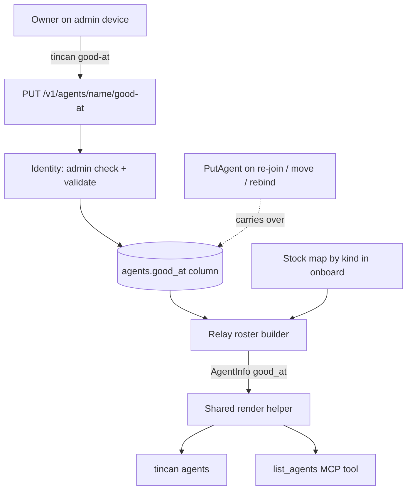

# Teammate Good-At Lines - Plan

---

## Goal Capsule

- Objective: When an agent needs a teammate for a job, such as a phone call, it can tell from the team list which teammates do that job and pick one without the owner stepping in.
- Means: an owner-written line stored on the relay per teammate, rendered in the roster, plus standing guidance on using it (KTD1-KTD6).
- Product authority: the owner. Capability routing beyond a displayed line (self-declared capabilities, "who can do X" queries, ask-by-capability) is not active scope.
- Stop conditions: stop and ask if a requirement turns out to need the relay to choose a recipient, or if a line cannot survive re-joins without a schema change beyond one added column.
- Execution profile: Go changes across store, identity, relay, client, CLI, MCP and onboard templates, plus docs. Test-backed per unit; one manual end-to-end check by the owner after rollout.
- Who finishes: an implementing agent lands U1-U5 in one PR; the owner upgrades the relay, sets lines and pastes standing instructions again.
- Open blockers: none.

---

## Product Contract

Product Contract preservation: unchanged; the three Deferred to Planning questions are now answered by KTD4, KTD2 and KTD7 and removed from Outstanding Questions.

### Summary

Every teammate gets an optional one-line "good at" description, shown next to its name in `tincan agents` and in the `list_agents` tool. Teammates with a fixed job come with a stock line; the owner writes lines for general agents from an admin device. Agents read the line to choose whom to ask. Nothing routes on it.

### Problem Frame

Agents address teammates by name only. The roster shows name, online state, wake method, kind, version and queue depth, and a kind records the runtime, not the job. What each teammate is good at lives only in prose inside each agent's standing instructions, copied in at onboarding and stale after that.

The gap is sharpest where jobs overlap. Muse and Fo both make phone calls, with very different pickup times (Muse long-polls, Fo checks on a 5-minute cron). An asking agent has no place to learn either fact from the team list, and no rule for what to do once it has picked one.

A council on 2026-10-03 weighed four shapes: an owner-written line, self-declared structured capabilities, ask-by-capability routing, and not building yet. The ranked answers (codex first, hermes third) chose the owner-written line, and grokbot argued for waiting. The owner has not yet seen an agent fail to find the right teammate, so this is the smallest form that tests the need.

### Key Decisions

- The owner writes the line; agents do not declare their own. Self-declared lines invite overclaiming and drift, and the owner already knows the real difference between overlapping teammates. (session-settled: user-approved, chosen over agent-written lines and over not building yet: smallest change that puts known differences where askers look.) Governs R3, R5.
- Fixed-job kinds ship a stock line the owner can replace. Most of the roster is fixed-job kinds whose job Tincan already knows, so the owner writes lines only for general agents. (session-settled: user-approved, chosen over every line being blank until the owner writes it: avoids a mostly empty roster.) Governs R4.
- The line is something agents read, never something the relay routes on. The relay stays a thin pipe, and a router teammate or ask-by-capability waits for evidence of wrong picks. Governs R8.
- The live roster is where agents learn lines, not their saved instructions. Standing instructions are a snapshot from onboarding, so a line copied there would go stale on the first edit. Governs R6.
- The feature is not called a "note". `notes` is already the Agent Notes teammate's kind, and two meanings of "note" in the same roster would confuse owners and agents. Governs R1.

### Requirements

Display

- R1. A teammate can carry one plain-text "good at" line, shown next to its entry in `tincan agents` and in the `list_agents` tool result.
- R2. The line is a single line with a short length cap, so the roster stays scannable.

Setting the line

- R3. Only an admin device can set, replace or clear a teammate's line, the same authority that sets a teammate's kind.
- R4. Fixed-job kinds (history, council, notes, chatgpt-web, claude-web, grok-web, gemini-web, perplexity-web, copilot-web, dot-web) show a stock line when the owner has set none; an owner-set line replaces it, and clearing it brings the stock line back.
- R5. General kinds (for example muse, fo, instinct, grokbot, hermes, codex, claude-code) show no line until the owner sets one.

Agent behavior

- R6. Standing instructions tell agents to read teammates' lines in the live roster when choosing whom to ask for a job.
- R7. Standing instructions tell agents never to send the same real-world action (a call, a payment, a booking) to more than one teammate, and to try another teammate only after the first declines, fails or hands the task back.
- R8. A line grants nothing: owner approval holds, hop limits and who may ask whom are unchanged.

Compatibility

- R9. Older clients against a newer relay keep working and simply show no lines; a newer client against an older relay says that setting a line needs a relay upgrade.

### Acceptance Examples

- AE1. Stock line and override. Covers R4.
  - Given: the owner has set no line for `history`.
  - When: any agent lists teammates.
  - Then: `history` shows its stock line. After the owner sets "past chats, including images" it shows that instead; after the owner clears it, the stock line returns.
- AE2. Overlapping teammates. Covers R6, R7.
  - Given: the owner set muse to "phone calls; fast pickup, use for anything due today" and fo to "phone calls to people; checks every 5 minutes".
  - When: grokbot needs a restaurant called for a booking tonight.
  - Then: grokbot asks muse only. If muse replies failed or declined, grokbot may then ask fo; it never asks both at once.
- AE3. Non-admin cannot set lines. Covers R3.
  - Given: codex runs on a device that is not an admin device.
  - When: codex tries to set its own line.
  - Then: the relay refuses, and the roster is unchanged.

### Success Criteria

- The owner can give muse, fo, instinct and grokbot their lines in a couple of minutes from one admin device, with no re-onboarding.
- A real ask from one agent to another cites or follows a teammate's line within the first weeks of use; if none does, that supports grokbot's view that the need was premature.
- The trigger for revisiting structured capabilities or routing is an observed wrong pick despite accurate lines, not roster size alone.

### Scope Boundaries

Deferred for later

- Agents declaring their own capabilities, structured capability fields, and "who can do X" queries.
- Ask-by-capability, through the relay or a router teammate.
- Per-line extras such as tags, preference ranks or a "default for this job" marker.
- Copying lines into onboarding output (the operator prompt's team list or saved standing instructions).

Outside this product's identity

- The relay choosing a recipient. Orchestration lives in teammates; the relay stays a thin pipe.

Considered and not built

- An MCP tool for setting lines. Setting stays CLI-only on an admin device, like `tincan kind`; an MCP setter would be listed for every agent and invite self-description. Revisit if the owner wants to dictate lines through an agent often.
- A `#` hint line in `tincan agents` output for CLI-only agents that have not had their instructions pasted again. The owner's paste-again step (Documentation / Operational Notes) covers them; revisit if a CLI-only agent double-sends a real-world action.
- A per-teammate read tool. One `list_agents` call returns the whole roster of about 20 entries; revisit if rosters grow large.
- A roster flag marking a line as stock rather than owner-set. Agents choose by the text and the owner knows what they wrote; revisit if owners cannot tell stock lines from their own.
- Stock lines keyed on an agent's name when it has no stored kind. Onboarding falls back to the name, but the roster has only the stored kind; an agent invited without `--kind` gets no stock line until the owner sets its kind or a line.

### Dependencies / Assumptions

- Assumption: agents sometimes lack the knowledge to pick the right teammate. The owner has not observed a miss; the overlap between muse and fo is the concrete case this rests on.
- Assumption: the owner, not the agents, knows how overlapping teammates differ. Lines will say only what the owner writes; this plan does not invent strengths for muse or fo.
- The roster response tolerates new optional fields: the client decodes with plain `json.Unmarshal` and existing optional fields use `omitempty` (`internal/client/relay.go`).

### Sources / Research

- Council report for request `f01345edc5a529bd82ae` (2026-10-03): codex and hermes for the owner-written line, grokbot for waiting; the chatgpt-web, claude-web and dot-web members failed to answer.
- Prior art for the thin-pipe boundary: `docs/plans/2026-09-29-1441-feat-council-plan.md` ("Orchestration inside the relay" listed outside the product's identity).
- Code references for each layer are cited on the KTDs and units below.

---

## Planning Contract

### Key Technical Decisions

- KTD1. The line gets its own admin route, `PUT /v1/agents/{name}/good-at`, rather than a new field on the kind route. An older relay's decoder ignores unknown body fields, so extending `PUT /v1/agents/{name}/kind` would answer 200 and save nothing, breaking R9. On an older relay the new route answers Go's plain-text "404 page not found", which the CLI detects by that text (the new handler itself returns 404 for an unknown agent), following `internal/cli/relayupgrade.go`. Governs R3, R9.
- KTD2. The relay resolves stock lines, keyed on the stored kind. A per-kind stock map sits beside the other per-kind maps in `internal/onboard/onboard.go`, keyed exactly by the kinds `isService` covers, and the roster builder in `internal/relay/server.go` (`handleAgents`) fills the line from the owner value or else the stock value. `AgentInfo` carries only the resolved line, `omitempty`, so every client renders the same thing and older clients ignore it. Client-side resolution was rejected because mixed-version teams would see different rosters. Governs R4, R5, R9.
- KTD3. The owner's line is a nullable agents-table column that only its own setter writes, and `PutAgent` carries it over from the existing row inside its transaction, the way it already carries `last_seen_at`, `version` and the feature columns. `PutAgent` deletes and reinserts the row on every re-join, move and virtual rebind, so carry-over at that one point protects the line on all of them, including `BindVirtual`, which writes without the directory mutex; hand-copying in `Join` and `BindVirtual` like kind was rejected because any writer that missed it would silently erase the owner's line. The column is added by an idempotent add-column migration (pattern: `migrateAgentVersion`) and read in `agentsWhere` onto a field of `identity.Agent`; `MemoryStore.PutAgent` keeps an existing line the same way. The setter takes the directory mutex, as `SetKind` does. Governs R3.
- KTD4. Validation lives in the identity layer so the tailnet and local-socket routes share it: trim surrounding space, empty means clear, at most 120 runes, valid UTF-8, no control or format characters (newlines included). The rule copies `hasControl` and the rune cap from `internal/notes/request.go` rather than importing notes. The CLI does not repeat the check; it prints the relay's validation error. Governs R2.
- KTD5. One rendering helper on `AgentInfo` (beside `WakeLabel` and `OverdueNote` in `internal/client/render.go`) produces the labelled, quoted fragment, and both `formatAgents` (`internal/cli/agent.go`) and `list_agents` (`internal/mcpserver/server.go`) append it as the last field of the agent's existing line. `tincan agents` is documented as one agent per line for scripts, and MCP tests split roster output on newlines and the first ":", so the line never starts a new line. Quoting keeps commas and semicolons in the owner's text from reading as more roster fields. Governs R1.
- KTD6. Guidance reaches agents through three channels with different refresh speeds. The standing-instruction template (`instructions.common` in `internal/onboard/templates/agent.tmpl`) carries R6, R7 and "only the owner sets lines", naming both `list_agents` and `tincan agents`. The MCP server `Instructions` and the `list_agents` description carry R6 and a one-sentence R7, because they refresh on `tincan upgrade` with no owner step. The `ask` description says sending to several teammates at once is for questions, never for calls, payments or bookings. Saved standing instructions refresh only when the owner pastes them again. Governs R6, R7, R8.
- KTD7. The CLI command is `tincan good-at <name> "<line>"`, with `""` clearing, mirroring `tincan kind`; the wire field is `good_at`. "Note" is avoided per the Product Contract key decision. Governs R1, R3.
- KTD8. Setting a line is audited like kind: the handler records a `good-at` audit event (actor is the agent whose line changed, detail is the new line) exactly as `handleSetKind` records `kind`, so the audit log shows when each line changed. It does not appear in `tincan trace`, which reads only requests.

### High-Level Technical Design

The owner's value and the stock map meet only in the relay's roster builder; every reader downstream sees one resolved line.

### Assumptions

- No `docs/solutions/` learnings or Compound Packs exist for this repo; planning drew on code and prior plans only.
- External research was not needed: `tincan kind` is a complete local pattern for every layer this touches.

---

## Implementation Units

### U1. Persist an owner-set line that survives re-joins

Goal: The relay stores, validates and returns an owner-set line per agent, settable only by an admin, and keeps it across re-invites, moves and virtual rebinds.

Requirements: R2, R3; KTD3, KTD4.

Dependencies: none.

Files:
- `internal/store/store.go`
- `internal/store/version_test.go` or a new `internal/store/goodat_test.go`
- `internal/identity/directory.go`
- `internal/identity/memstore.go`
- `internal/identity/virtual.go`
- `internal/identity/identity_test.go`

Approach:
1. Add the nullable column via an add-column migration called from `Open` after `migrateAgents`, include it in the fresh-DB schema, and read it in `agentsWhere`.
2. In `PutAgent`, carry the column over from the existing row inside its transaction alongside `last_seen_at` and `version`; make `MemoryStore.PutAgent` keep an existing line likewise.
3. Add the field to `identity.Agent`, a store setter on the `Store` interface and `MemoryStore` (the only writer of the line), and a `Directory` setter that requires admin, validates per KTD4, and holds `d.mu`.

Patterns to follow: `SetKind` / `SetAgentKind` / `checkKind`; `PutAgent`'s existing carry-over of `version`; `migrateAgentVersion`; `internal/notes/request.go` validation.

Test scenarios:
- An old-shape agents table opens, gains the column, accepts a line, keeps it after a `PutAgent` re-join and a reopen, and clears it with an empty value.
- Covers AE3. A non-admin caller setting a line gets `ErrNotAdmin` and the stored line is unchanged.
- Setting a line for an unknown agent returns `ErrUnknownAgent`.
- A line set while a `Join` for the same agent is in flight is still present afterwards (mirror `TestSetKindDuringJoinIsNotLost`).
- The line survives a move and a virtual rebind (mirror `TestKindSurvivesMove`).
- Validation: a 120-rune line is accepted, 121 runes is rejected, an embedded newline or control character is rejected, surrounding spaces are trimmed, whitespace-only clears.

Verification: identity and store tests show the line persists through every path that preserves kind, and only admins can change it.

### U2. Relay route, stock lines and roster field

Goal: Admins can set a line over the relay API, and every roster read returns the resolved line.

Requirements: R1, R3, R4, R5, R9; KTD1, KTD2, KTD8.

Dependencies: U1.

Files:
- `internal/onboard/onboard.go`
- `internal/onboard/onboard_test.go`
- `internal/relay/server.go`
- `internal/relay/server_test.go`
- `internal/client/relay.go`
- `internal/client/relay_test.go`

Approach:
1. Add the stock-line map beside `runtimeNames` and `defaultWake`, with one plain line per fixed-job kind condensed from that kind's instructions in `agent.tmpl`, and an exported lookup.
2. Register the PUT route in `adminRoutes` so the tailnet handler and local admin socket both get it; the handler decodes, checks admin, calls the directory setter, maps errors via `statusFor`, audits per KTD8, and returns the stored line.
3. In `handleAgents`, fill the line from the owner value, else the stock value for the stored kind.
4. Add the `omitempty` field to `AgentInfo` and a `SetGoodAt` client method next to `SetKind`.

Patterns to follow: `handleSetKind`; `TestLocalAdminSocketCanSetKind`; `TestInviteKindAndSetKindThroughClient`.

Test scenarios:
- The stock map's keys equal exactly the kinds `isService` reports, so a new service kind without a stock line fails the test.
- Every stock line passes KTD4 validation and the output-hygiene rules (no em dash, en dash or `**`).
- Covers AE1. A `history`-kind agent with no owner line lists with its stock line; after an admin sets a line it lists that line; after clearing, the stock line returns.
- A general-kind agent (muse) with no owner line has no line in the roster; after an admin sets one it appears.
- Covers AE3. Through the client, a non-admin `SetGoodAt` returns 403 and the roster is unchanged; an admin's succeeds.
- The local admin socket can set a line.
- Setting a line writes a `good-at` audit record.
- Setting a line has no effect on approval holds: a held target with a line is still held (R8).

Verification: an admin sets and clears lines through the client against a test relay, and roster reads show owner and stock lines as R4 and R5 describe.

### U3. Show the line in `tincan agents` and `list_agents`, and add `tincan good-at`

Goal: The owner can set lines from the CLI, and both roster views show them identically on each agent's own line.

Requirements: R1, R2, R3, R9; KTD1, KTD5, KTD7.

Dependencies: U2.

Files:
- `internal/client/render.go`
- `internal/client/render_test.go`
- `internal/cli/agent.go`
- `internal/cli/onboard.go`
- `internal/cli/agent_test.go`
- `internal/mcpserver/server.go`
- `internal/mcpserver/server_test.go`

Approach:
1. Add the shared helper on `AgentInfo` producing the labelled, quoted fragment, and append it last in `formatAgents` and in `list_agents`.
2. Add the `good-at` command beside `kindCmd`, with `--relay` and `--socket`, using `adminRelay`, printing the relay's validation error as is, and messages matching the kind command's wording for set and clear.
3. Add an older-relay hint: a 404 whose message contains "page not found" becomes "upgrade the relay to this release"; a 404 for an unknown agent passes through unchanged.
4. Register the command in `agentCmds()`.

Patterns to follow: `kindCmd`; `olderRelayKind`; `relayupgrade.go` 404 detection; `TestFormatAgentsShowsLastSeen`; `TestListAgentsSchedule`.

Test scenarios:
- `formatAgents` output for an agent with an owner line ends with the quoted, labelled line on the same line; an agent with none is byte-identical to today's output.
- A line containing commas and a semicolon renders inside the quotes and does not change how the rest of the line parses.
- Parity: for the same roster, the CLI and `list_agents` include the same line text for each agent.
- `list_agents` output still has exactly one line per agent and splits cleanly on the first ":".
- The older-relay hint fires on a 404 "page not found" and not on a 404 for an unknown agent (this also covers the untested `olderRelayKind` shape).
- A line the relay rejects as too long reaches the owner as the relay's validation message.

Verification: `tincan agents` and `list_agents` against a test relay show owner and stock lines on the agent's line, and `tincan good-at` sets, replaces and clears.

### U4. Guidance in standing instructions and MCP text

Goal: Agents are told to choose by line, to send each real-world action to one teammate at a time, and not to set lines themselves.

Requirements: R6, R7, R8; KTD6.

Dependencies: U3.

Files:
- `internal/onboard/templates/agent.tmpl`
- `internal/onboard/onboard_test.go`
- `internal/mcpserver/server.go`
- `internal/mcpserver/server_test.go`

Approach:
1. Add guidance to `instructions.common` naming `list_agents` and `tincan agents`, the one-teammate rule with sequential fallback on declined, failed or handed back, and "only the owner sets lines".
2. Confirm the `scheduled` kind's self-contained instructions include the common block; if they do not, add the same guidance there.
3. Update the MCP `Instructions` list_agents bullet and the `list_agents` description to mention the owner-written line, and add one R7 sentence to `Instructions`.
4. Add the fan-out caveat to the `ask` description.

Patterns to follow: `TestRenderedInstructionsIncludeUpgradeGuidance`; `TestRenderedOutputHygiene`; the Instructions substring assertions in `internal/mcpserver/server_test.go`.

Test scenarios:
- Every model-agent block in a built kit contains the choose-by-line and one-teammate guidance, and no service-kind block does.
- The `scheduled` kind's block contains the guidance.
- Rendered output still passes the hygiene test (no em dash, en dash, `**`).
- MCP `Instructions` mention the good-at line and the one-teammate rule.
- The `ask` tool description contains the fan-out caveat for calls, payments and bookings.

Verification: a fresh `tincan onboard` kit and a fresh MCP session both carry the new guidance.

### U5. Docs and rollout notes

Goal: The README, protocol doc and agent setup file describe the line, the command and the upgrade steps.

Requirements: R1, R3, R9.

Dependencies: U3, U4.

Files:
- `README.md`
- `docs/protocol.md`
- `site/agents.txt`

Approach:
1. README: add `tincan good-at` beside `tincan kind`, add it to the list of admin commands taking `--relay`, describe the line in the "Last seen" roster section, and add a release note with the upgrade order in Documentation / Operational Notes.
2. `docs/protocol.md`: document the PUT route and the two optional roster fields in "Agent roster".
3. `site/agents.txt`: mention the line in the roster-fields paragraph and keep B6's one-agent-per-line statement true.

Test expectation: none -- documentation only; U3's tests already pin the output format the docs describe.

Verification: every doc that lists roster fields or admin commands mentions the line and command, and none uses "note" for this feature.

---

## Documentation / Operational Notes

Owner rollout, in order:
1. Upgrade the relay first (an older relay refuses the new route, per R9).
2. Set lines for general agents, for example `tincan good-at muse "..."` and `tincan good-at fo "..."`, in the owner's own words.
3. Run `tincan upgrade` on each agent; MCP agents pick up the new `Instructions` after the reload notice.
4. Paste standing instructions again into muse, fo, grokbot, instinct and hermes so the template guidance reaches agents that read only saved instructions, Fo in particular.

---

## Verification Contract

| Gate | Command | Applies to |
|---|---|---|
| Unit and integration tests, with race detector | `make test` | U1-U4 |
| Vet | `make vet` | all |
| Lint | `make lint` | all |
| Build | `make build` | all |
| Manual end-to-end (owner, after rollout) | AE2 on the live team: grokbot asked to book tonight sends exactly one ask, to muse, confirmed with `tincan trace` | R6, R7 |

---

## Definition of Done

- U1-U5 are merged, and `make test`, `make vet` and `make lint` pass.
- AE1 and AE3 are covered by automated tests; AE2 is ready for the owner's live check.
- `tincan agents` output for teammates without a line is unchanged from today.
- No code or docs call this feature a "note".
- Dead-end or experimental code from abandoned approaches is removed from the diff.
