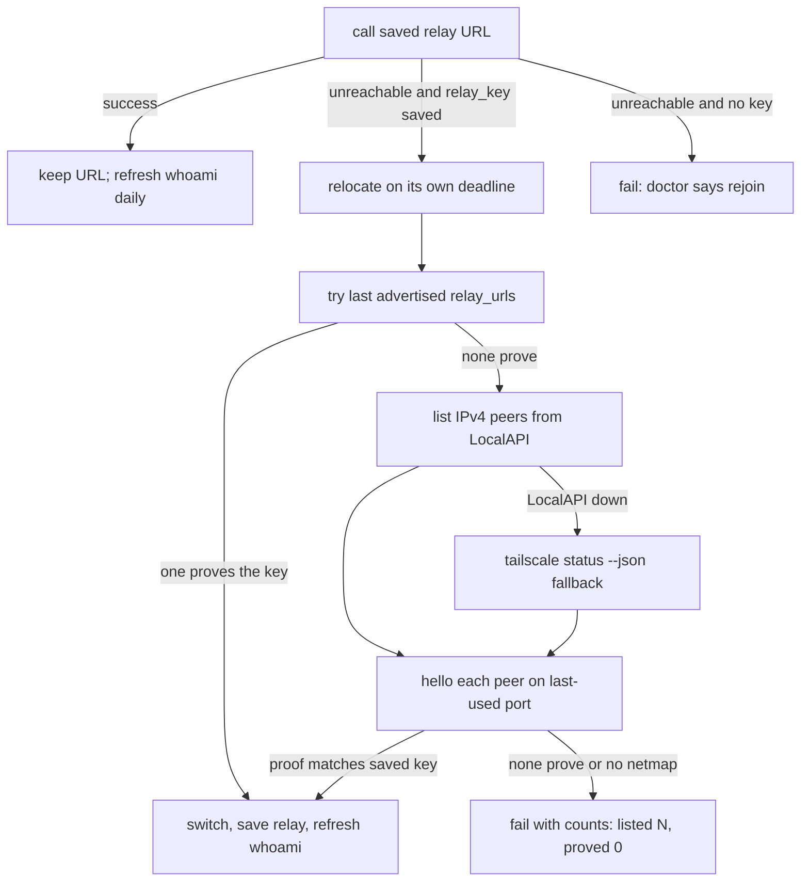

# Live relay discovery after a tailnet identity change - Plan

---

## Goal Capsule

- Objective: a joined client whose saved relay URL goes silent finds the live relay on the same tailnet, keeps using the address that last worked, and does not depend on a frozen list of host names.
- Means: keep the existing relay key and `/v1/hello` proof; when the saved URL is unreachable, enumerate IPv4 peers from the local Tailscale netmap (LocalAPI first), probe the last-used port, and persist the peer that proves the key (KTD1 to KTD4).
- Authority: Requirements (R) win on product behavior; KTDs win on mechanism within their cited Rs; units override neither.
- Stop conditions: stop and ask if discovery would need a new `/v1` route, a required protocol field, a Tailscale account API token, or a client-side list of host names. Stop if a unit would probe peers without the saved relay key.
- Execution profile: Go, agent-tincan only. Client-side discovery plus a listen-port advertisement fix. One implementation PR after this plan is accepted.
- Who finishes: the implementer lands the code PR; the owner upgrades clients (and the relay if it is still on `--listen` and proxy-only agents must survive the next host refresh without a rejoin).
- Open blockers: none.

---

## Product Contract

### Summary

Clients already save the last relay URL that worked, and they already know how to ask a candidate "are you my relay?" with a nonce. That recovery still fails when the relay host is re-registered on Tailscale, because the addresses the relay advertised are the host's MagicDNS name and CGNAT IP, and the follow-up scan of the tailnet is too narrow to see the new node.

After this work, a client that can see the tailnet netmap finds the live relay by proof, not by guessing names. A client that cannot see the netmap (proxy-only) keeps the last working URL and the relay's advertised addresses, and the docs tell the operator that those addresses only stay valid across a host refresh if the relay is its own tailnet node.

### Problem Frame

On 2026-10-03 the relay was running on a host machine with tincan 0.10.1, listening on `:8787`. Tailscale had re-registered that computer after a refresh:

| | Dead node | Live node |
|---|---|---|
| Hostname | `relay-host-1` (an older dead address was `100.64.0.5`) | `relay-host` |
| MagicDNS | (stale) | `relay-host.example.ts.net` (does not always resolve) |
| IPv4 | `100.64.0.10`, offline since about 2026-10-01 evening PT | `100.64.0.20` |

Other agents (`fo` as `agent-sandbox` at `100.64.0.30`, `instinct`, `muse`) still had the old relay address in their client config. Their Tailscale pings to `relay-host-1` timed out, so inbox checks failed even though the live process answered on the new node. From the live node, `tailscale ping` to `agent-sandbox` succeeded.

This is the documented `--listen` path: the host already runs Tailscale, so the relay binds the host CGNAT IP (`tincan relay --listen <tailscale-ip> --port 8787`) and agents join with `http://<tailscale-ip>:8787`. That IP and the host MagicDNS name both change when the machine is re-registered. The next refresh will mint a third host name (`relay-host-2`, or whatever Tailscale assigns). A client that tries `relay-host` then `relay-host-1` as ordered backups will miss it.

The code already has a recovery path (`internal/client/discover.go`): save `relay_key` and `relay_urls` from `/v1/whoami`, and when the saved URL is unreachable, try those advertised URLs, then every online peer from `tailscale status --json`, on the same port, following only a `/v1/hello` HMAC proof of the key. That path did not recover the live node. The gaps, from the code:

1. Advertised URLs are the host MagicDNS name and IP (`LocalResolver.SelfURLs`). With `--listen` those are the host identity, so they go stale together.
2. Peer listing shells out to the `tailscale` CLI and skips any peer with `Online == false`. A missing binary, a cron `PATH` without `tailscale`, a userspace socket the CLI never sees, or a new node not yet marked online, yields an empty candidate list. The miss is silent.
3. `relocate` returns immediately when the caller's context is already done (`ctx.Err() != nil`), so a timed-out inbox check never searches.
4. A successful move updates `relay` in the config file but does not refresh `relay_urls`, so the next failure still spends hello probes on the dead host name first.
5. `--listen <ip>:<port>` binds that port, but `SelfURLs` is called with `--port` (default 80). Advertised URLs can name the wrong port. The onboard recipe uses `--listen <ip> --port 8787`, which matches; `--listen <ip>:8787` without `--port` does not.
6. Proxy-only sandboxes (Muse's tunnel proxy) have no local tailscaled. `tailnetCandidates` returns nothing. They can only try advertised URLs, which `--listen` ties to the host name.

### Actors

- A1. Owner: runs the relay host and upgrades clients.
- A2. Joined agent with a local tailnet node (`agent-sandbox`, Instinct when it has tailscaled, agents on the relay host, laptop agents): can read the netmap.
- A3. Proxy-only agent (Muse): reaches the tailnet only through a configured HTTP proxy; cannot list peers.
- A4. Relay process: holds `relay.key`, answers `/v1/hello` without join, advertises addresses in `/v1/whoami`.

### Key Decisions

- Discover by live netmap proof, not by a list of host names. Governs R1, R2, R3. (session-settled: user-directed: an ordered backup of `relay-host` then `relay-host-1` was rejected because the next refresh mints a third name)
- Keep the existing relay key and unauthenticated `/v1/hello` HMAC as the only "this is my relay" check. Governs R4, R6. (session-settled: code-grounded: `relay.key`, whoami `relay_key`, and hello already exist since 0.5.0-rc12; a new protocol is unnecessary and would strand mixed-version meshes)
- Enumerate peers from Tailscale LocalAPI, with the CLI as fallback; do not require `Online`. Governs R2, R5. (session-settled: code-grounded: the relay already uses `tailscale.com/client/local` in `internal/identity`; the client currently only execs `tailscale status --json` and drops offline peers)
- Proxy-only clients cannot query the tailnet. Their survival across a host re-registration is a stable relay node (`tincan relay` without `--listen`), not a second discovery protocol. Governs R7, R8. (session-settled: code-grounded: doctor already says a proxy-only sandbox cannot search the tailnet)

### Requirements

Last working address

- R1. The client keeps using the relay URL that last succeeded. A found address is written back to the same config file the client was built from (`NewRelayFor` / `NewRelayForFile`), and is not written when `TINCAN_RELAY` overrides the file.
- R2. When that URL stops answering (dial timeout, refused, no route, unknown host, or a proxy 502/504), the client discovers the live relay on the tailnet instead of walking a saved host-name list.

Discovery

- R3. Discovery does not assume the host name is `relay-host`, `relay-host-1`, `tincan-relay`, or any other fixed string. Candidates come from the current netmap and from addresses the live relay last advertised about itself, never from a client-side ordered backup of names.
- R4. A candidate is followed only when `/v1/hello` returns `service=agent-tincan-relay` and an HMAC proof of the saved `relay_key`. An impostor on the tailnet is ignored. No key means no search.
- R5. A client with a reachable Tailscale LocalAPI or `tailscale` CLI lists every IPv4 peer on the netmap (online or not) and probes the scheme and port of the last working URL. The `tailscale` binary being absent from `PATH` is not enough to skip the search.
- R6. Existing `/v1/hello` and `/v1/whoami` stay unchanged. Older relays keep working; older clients keep working against a new relay and simply do not get the tighter search.

Clients that cannot list the tailnet

- R7. A proxy-only client (no LocalAPI, no CLI) does not invent a tailnet query. It keeps trying the last working URL and the relay's advertised addresses. `tincan doctor` says that this client cannot search the tailnet and, if the saved URL is dead, to `tincan rejoin --relay <url>`.
- R8. Docs and the relay-host recipe state that `--listen` borrows the host's tailnet identity, which changes when that host is re-registered, and that `tincan relay` without `--listen` (tsnet node `tincan-relay`, state dir kept) is the way a proxy-only agent survives that event without a rejoin.

Operator and migration

- R9. After a successful find, the client saves the new URL as `relay` and refreshes `relay_key` / `relay_urls` / `relay_info_at` from whoami so the next failure does not prefer the dead host name.
- R10. `tincan doctor` distinguishes: key missing (cannot search); key present but no local netmap (cannot search); netmap listed N peers and none proved; found and saved a new URL.
- R11. Clients that already have a stale URL and a saved key recover on the next ordinary call (`tincan inbox`, `check_inbox`, `wait`, `listen`, `mcp`) after they run a build that includes this search. Clients with a stale URL and no key need one `tincan rejoin --relay <live URL>` (or an equivalent `TINCAN_RELAY` for a single process, which still does not persist the key).

### Acceptance Examples

- AE1. Covers R1, R2, R3, R4, R5, R9. Config has `relay=http://100.64.0.10:8787` and a real `relay_key`. The netmap contains an offline `relay-host-1` at that old IP and an online `relay-host` at `100.64.0.20`, and also a later-named peer at another IP. Only `100.64.0.20:8787` proves the key. The next inbox call succeeds there, and the config's `relay` is that URL, with `relay_urls` from the live whoami (not `relay-host-1`).
- AE2. Covers R3, R4. The same netmap includes a peer that answers hello under a different key. The client does not switch to it.
- AE3. Covers R5, R10. `PATH` has no `tailscale` binary. LocalAPI status still lists the live peer. Discovery succeeds. Doctor does not say the client cannot search.
- AE4. Covers R7, R10. No LocalAPI and no CLI (proxy-only). Advertised URLs are the dead host name. Doctor fails the relay check and says this client cannot search the tailnet and to rejoin with a live URL.
- AE5. Covers R11. A keyless config with the dead URL does not scan. Doctor's fix is rejoin. After rejoin at the live URL, the key is saved and a later move is found as in AE1.

### Scope Boundaries

- No client-side list of host names, including `relay-host` / `relay-host-1` / `tincan-relay` as ordered backups.
- No Tailscale account API (no OAuth, no API keys on agents).
- No new `/v1` route. Hello and whoami stay as they are.
- No change to agent rebind (re-admitting a rebuilt *agent* machine). That already exists and is about WhoIs identity, not finding the relay.
- No dual-stack listen; the relay stays IPv4-only, and discovery still skips IPv6 peer addresses.
- No change to join, invite, or the trust model of `relay.key`.

#### Deferred to Follow-Up Work

- Automatically running a tsnet node *alongside* `--listen` so `--listen` hosts also advertise `http://tincan-relay`. That would help proxy-only agents without a rejoin, but it is a second tailnet node and a relay-startup change. This plan documents the existing tsnet mode instead.
- Refreshing `SelfURLs` for the lifetime of a `--listen` process if the host IP changes in place. A Tailscale re-registration that mints a new node requires a new process bind anyway.

---

## Planning Contract

### Key Technical Decisions

- KTD1. Recovery stays "last URL, then prove candidates with `/v1/hello` under the saved key." Do not add a host-name fallback. Advertised `relay_urls` remain an optional fast path (they still help when only the IP changed, or when the relay is tsnet `tincan-relay`), but they are not sufficient and they are never a list the client authors. After a find, whoami overwrites them (R9).
- KTD2. Peer listing uses `tailscale.com/client/local` `Status` (the same LocalAPI the relay already uses for WhoIs), returning every peer's first IPv4 address, including `Online == false`. CLI `tailscale status --json` remains a fallback when LocalAPI is unreachable, parsed into the same IPv4 list, also without an Online filter. Honor `TS_SOCKET` / the default `local.Client` socket lookup. Do not exec the CLI first: cron and sandbox `PATH`s are why the current search returns nothing.
- KTD3. The probe port is the port of the last working URL (`r.Base()`), defaulting as today when the URL has no port. Do not scan extra ports. Do not probe IPv6. Cap the search with the existing hello timeout and a slightly larger overall bound so a cancelled parent context cannot skip the search: `relocate` must use a context that is not already dead (`context.WithoutCancel` plus its own deadline, in the spirit of `RetryPongs`).
- KTD4. `--listen` advertisement uses the port the process actually bound, not the `--port` flag when `--listen` carried `:port`. Pass that port into `SelfURLs`. This is a one-line relay fix plus a test; it does not make `--listen` names stable, but it stops advertising `:80` while serving `:8787`.
- KTD5. Proxy-only clients stay on advertised URLs plus the last working address. The smallest thing that still survives a *host* hostname change for them is operational: run the relay without `--listen` so its node is `tincan-relay` and that name is what `SelfURLs` advertises. The code cannot list Muse's tailnet from inside the hatch proxy.
- KTD6. Doctor and the move log line must be specific enough to debug the next host refresh: whether LocalAPI or the CLI supplied peers, how many IPv4 candidates were probed, and whether a proof succeeded. Today's "no online tailnet peer proved it is this relay" is true of both "we listed nobody" and "we listed twenty and none matched."

### High-Level Technical Design

What a client does when the saved URL is silent:

Identity of the relay does not come from DNS:

| Source | Stable across host re-register? | Used as |
|---|---|---|
| Saved `relay` URL | No (it is the last place that worked) | Primary address (R1) |
| `relay_urls` from whoami | Only if the relay is tsnet `tincan-relay` | Fast path, then discarded after a find |
| Host names `relay-host`, `relay-host-1`, … | No | Not used |
| Local netmap IPv4 + hello proof | Yes, as long as the live node is in the caller's netmap | Recovery (R2, R5) |
| `relay.key` | Yes, it lives in the relay state dir | Proof (R4) |

`--listen` vs tsnet, as the code works today:

- Default `tincan relay`: tsnet node `--hostname tincan-relay`. Host Tailscale re-registration does not change that node if `--state-dir` is kept. `SelfURLs` advertises `http://tincan-relay…` first. Proxy-only clients can keep using that name.
- `--listen 100.x.y.z --port 8787`: process is the host node. `SelfURLs` advertises the host MagicDNS name and that IP. Both change on re-register. Clients with a netmap recover via KTD2. Proxy-only clients need a rejoin, or the operator switches to tsnet.

### Alternatives considered

- Ordered host-name backups (`relay-host`, then `relay-host-1`). Rejected: the next refresh mints a third name; MagicDNS for the live name does not always resolve.
- Tailscale control-plane API from the client. Rejected: agents have no API token; the repo has no such client; LocalAPI is already a dependency.
- Drop `--listen` in code. Rejected as a hard removal: it is a supported bind mode for a host that already runs tailscaled. Document its identity cost instead (KTD5).
- Hello without a key, following any `agent-tincan-relay`. Rejected: a second relay on the same tailnet could pull agents over. The key is the trust check the code already has.

### Assumptions

- Personal tailnets are small enough that probing every IPv4 peer in parallel (existing 4s hello timeout, about 8 to 15s overall) is acceptable.
- The live relay node appears in other agents' netmaps even when MagicDNS is flaky. If a client cannot see the new node at all, no in-process discovery can find it; doctor then says so.
- Fo's sandbox has a local tailscaled (it has a CGNAT address and the live host can ping it). Instinct may have tailscaled or only a SOCKS path; the latter is treated like proxy-only (R7).

### Sequencing

U1 (search) first. U2 (persist + context) depends on U1. U3 (advertised port + doctor) can follow U1. U4 (docs and recipes) last. Tests for each unit land with that unit.

---

## Implementation Units

### U1. Netmap peer listing without host names or Online

- Goal: when the saved URL is silent and a key is present, list IPv4 peers from LocalAPI (CLI fallback) and follow the one that proves the key, regardless of host name or Online.
- Requirements: R2, R3, R4, R5, R6; KTD1, KTD2, KTD3.
- Dependencies: none.
- Files:
  - `internal/client/discover.go`
  - `internal/client/discover_test.go`
- Approach:
  1. Replace `tailnetCandidates`'s CLI-only, Online-filtered parse with a `netmapIPv4s(ctx)` that prefers `local.Client{}.Status`, then CLI JSON into the same shape.
  2. Keep advertised `r.known` as the first candidates; append every peer IPv4 except the current base host, using `url.Scheme` and port from `r.Base()`.
  3. Do not read or compare `HostName` / `DNSName`.
  4. Keep hello proof, impostor rejection, IPv6 skip, and `findEvery`.
  5. Give `relocate` its own deadline so a spent caller context does not skip the search (KTD3).
- Patterns to follow: existing `findRelays` hook in tests; `internal/identity.LocalResolver` for LocalAPI construction; `RetryPongs` for remaining-deadline handling.
- Test scenarios:
  - Covers AE1. Fixture netmap: dead offline IP (saved URL), live IP that proves the key, later-named peer that also proves nothing; saved URL unreachable; `Agents` succeeds at the live URL. Host names in the fixture must not be consulted.
  - Covers AE2. Live-looking peer proves the wrong key; base stays on the dead URL.
  - Covers AE3. `findRelays` LocalAPI path returns the live IP when the CLI function is stubbed empty.
  - CLI JSON fixture with `Online: false` on the live peer is still probed (regression for today's filter).
  - No key: still no search (`TestRelayNotSearchedWithoutKey`).
  - Proxy 502/504 still counts as unreachable.
  - `relocate` still runs when the parent context is already cancelled after the failed call.
- Verification: `go test -race ./internal/client/ -run 'Discover|RelayMoved|RelayNot|LearnRelay|ProxyGateway|EnvRelay'`.

### U2. Persist the found URL and refresh advertised addresses

- Goal: the last working address is the saved `relay`, and `relay_urls` after a move are the live relay's, not the dead host.
- Requirements: R1, R9, R11; KTD1.
- Dependencies: U1.
- Files:
  - `internal/client/discover.go`
  - `internal/client/config.go` (comments only if needed)
  - `internal/client/discover_test.go`
  - `internal/cli/agent.go` (only if `LearnRelayKey` must run on the relocate path from CLI helpers; prefer calling it from `relocate` itself)
- Approach: on a successful find, keep `updateSavedRelay`; then whoami at the new base (still `callOnce` so it cannot recurse) and write `relay_key` / `relay_urls` / `relay_info_at` to the same file, same `TINCAN_RELAY` skip as today.
- Test scenarios:
  - After AE1, loaded config `relay` is the live URL, `relay_key` unchanged, `relay_urls` equal whoami's list (live MagicDNS + live IP), `relay_info_at` set.
  - `TINCAN_RELAY` still blocks file writes (`TestEnvRelayOverrideNeverWrites`).
  - `NewRelayForFile` still writes only that file (`TestNewRelayForFileWritesToItsOwnFile`).
- Verification: the same client test command as U1.

### U3. Advertised port and doctor diagnoses

- Goal: advertised URLs use the bound port; doctor explains why a search did not run or did not prove anyone.
- Requirements: R8, R10; KTD4, KTD6.
- Dependencies: U1.
- Files:
  - `internal/cli/relay.go`
  - `internal/cli/freshinstall_test.go`
  - `internal/cli/doctor.go`
  - `internal/cli/doctor.go` tests (`internal/cli/doctor_test.go`, `internal/cli/doctor_configs_test.go`)
- Approach:
  1. After `listenAddr`, pass the bound port into `SelfURLs` (parse it from `listenAt` when `--listen` is set).
  2. Doctor relay-failure copy: no key; key but zero netmap sources; key and N candidates none proved. Keep the proxy-only rejoin sentence when there is no netmap.
  3. If whoami succeeds only after relocate, relay check is ok and mentions the new URL (doctor already uses `r.Raw`, which calls `relocate`).
- Test scenarios:
  - `listenAddr("100.64.1.2:9000", 8787)` already returns `:9000`; add a test that the port handed to `SelfURLs` is 9000, not 8787. If `openRelayNet` / `SelfURLs` are hard to hook, a small helper `advertisePort(listenAt string, flagPort int) int` is enough.
  - Doctor with unreachable URL and empty key: today's rejoin-because-no-key line.
  - Doctor with key and a stub netmap of 0: cannot-search line.
  - Doctor with key and impostor-only netmap: none-proved line.
- Verification: `go test -race ./internal/cli/ -run 'ListenAddr|Doctor|RelayMoves|JoinSavesRelayKey'`.

### U4. Docs, recipes, and stale-config migration

- Goal: operators and agents know how discovery works, what `--listen` costs, and how to recover a mesh that already saved a dead URL.
- Requirements: R7, R8, R11.
- Dependencies: U1, U2, U3.
- Files:
  - `README.md` ("When the relay's address changes")
  - `internal/onboard/templates/recipes.tmpl` (`recipe.relay-host`)
  - `internal/onboard/onboard_test.go` (string assertions on the recipe)
  - `site/agents.txt` (PART A: prefer tsnet; `--listen` identity warning)
  - `docs/adapters/proxy-sandbox.md` (cannot search; rejoin or tsnet)
  - `docs/adapters/scheduled.md` (Fo: doctor / inbox after a host refresh)
  - `docs/adapters/e2b.md` (Instinct: same if the sandbox has no LocalAPI)
  - `docs/adapters/grokbot.md` (relay-on-this-VM: tsnet vs `--listen`)
- Approach:
  - README: last working URL; on silence, netmap IPv4 + hello, not host names; LocalAPI; `--listen` warning already logged at relay start stays accurate; proxy-only cannot search.
  - Recipe: tsnet first as the default that survives a host re-register; `--listen` second, with "agents find a new host IP themselves if they can see the tailnet; proxy-only agents need a rejoin or tsnet."
  - Migration (also in README, short): upgrade each client; next inbox/doctor with a saved key relocates; keyless `tincan rejoin --relay http://<live-ipv4>:8787` (or `http://tincan-relay` if the relay is tsnet); then `tincan doctor` until `relay moves` is ok.
- Test scenarios:
  - Recipe tests still see both `--listen` and tsnet, and they include the identity warning rather than "Agents use --relay http://<tailscale-ip>:8787" as the only join story.
- Verification: `go test ./internal/onboard/`; docs match the behavior in U1 to U3.

---

## Verification Contract

| Scope | Command | Proves |
|---|---|---|
| Client discovery | `go test -race ./internal/client/ -run 'Discover\|RelayMoved\|RelayNot\|LearnRelay\|ProxyGateway\|EnvRelay'` | AE1 to AE3, R1 to R6, R9 |
| CLI / doctor / listen port | `go test -race ./internal/cli/ -run 'ListenAddr\|Doctor\|RelayMoves'` | AE4, AE5, R10, KTD4 |
| Onboard copy | `go test ./internal/onboard/` | R8 recipe text |
| Full suite | `make test` | no regressions |
| Static | `make vet` and `make lint` | no new findings |
| Live (after the code PR, on the owner's tailnet) | On `agent-sandbox` (or any client with LocalAPI) leave the stale URL in config, run a build of this change, `tincan inbox` or `tincan doctor` | AE1: config `relay` becomes `http://100.64.0.20:8787` (or whatever the live IPv4 is), inbox works; log line `the relay moved from … to …` |
| Live (proxy-only) | Muse with the stale URL | AE4: doctor tells it to rejoin; after `tincan rejoin --relay <live URL>` inbox works. Optional: restart the relay without `--listen` so the next host refresh does not need a rejoin |

---

## Definition of Done

- R1 to R11 are covered by passing tests or the live checks above.
- AE1 to AE5 are demonstrated in tests; AE1 and AE4 also on the live mesh after the code PR.
- No client code path prefers `relay-host` or `relay-host-1`.
- No new `/v1` field or route.
- No abandoned-approach code (no leftover Online filter, no host-name table).
- Mixed-version: an old client against the current relay still talks if the saved URL works; a new client against an old relay still hello-proves.

---

## Sources

- `internal/client/discover.go` (`relocate`, `FindRelay`, `tailnetCandidates`, `LearnRelayKey`, `unreachable`, `HelloProof`).
- `internal/client/config.go` (`relay`, `relay_key`, `relay_urls`, `relay_info_at`, `TINCAN_RELAY`).
- `internal/client/relay.go` (`call` retries once after `relocate`; `NewRelayForFile`).
- `internal/client/http.go` (`dialTimeout` 5s so a dead CGNAT address fails fast).
- `internal/relay/hello.go` (`relay.key`, `/v1/hello`, `SetURLs`).
- `internal/identity/whois.go` (`SelfURLs`, `local.Client`, `Status` / `StatusWithoutPeers`).
- `internal/cli/relay.go` (`--listen`, `--port`, `--hostname tincan-relay`, advertisement log, `--listen` warning).
- `internal/cli/doctor.go` (relay / relay-moves / relay-addresses checks).
- `internal/onboard/templates/recipes.tmpl` (`recipe.relay-host` `--listen` vs tsnet).
- `README.md` section "When the relay's address changes".
- `docs/adapters/proxy-sandbox.md`, `docs/adapters/scheduled.md`, `docs/adapters/e2b.md`.
- Live mesh 2026-10-03: dead `relay-host-1` `100.64.0.10`, live `relay-host` `100.64.0.20:8787`, clients still on the old URL.
