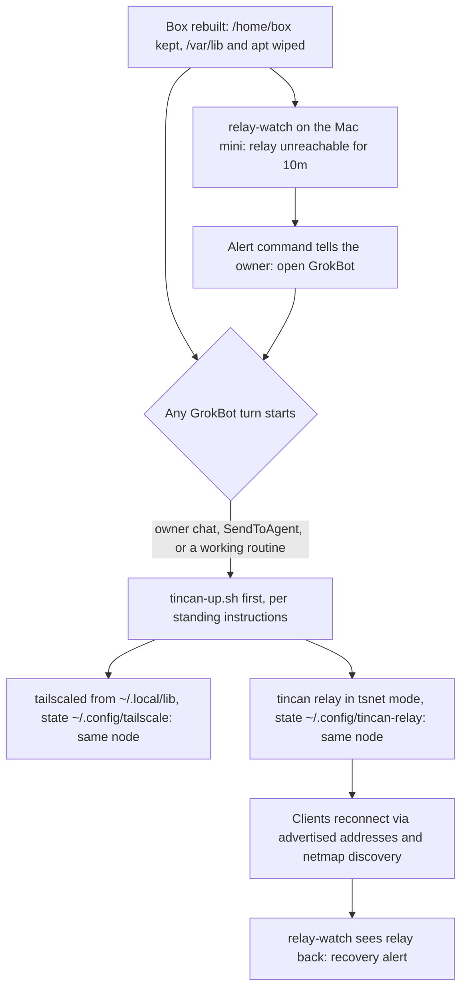
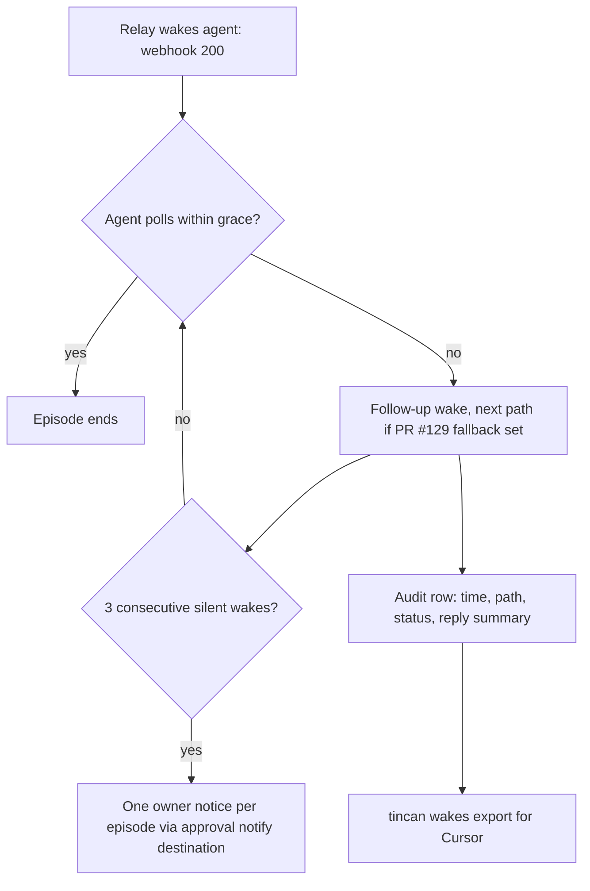

# GrokBot Survives Rebuilds and Silent Wakes - Plan

## Goal Capsule

- **Objective:** When GrokBot's computer is rebuilt or Cursor's routine runner stops starting GrokBot, the owner's Tincan team either keeps working or the owner hears about it within minutes, through a channel that still works when the relay is down, and the owner holds a dated record that shows Cursor where its routines failed.
- **Means:** Keep the relay on GrokBot's box but move every piece of state it needs into the home folder that survives a rebuild (KTD1, KTD2), start it from the first GrokBot turn after a rebuild (KTD3), and add two alarms plus a wake timeline export (KTD4, KTD5, KTD6).
- **Authority:** Product Contract requirements win on behavior. KTDs win on mechanism. Units override neither.
- **Stop conditions:** Stop and ask the owner if the one-time migration (U6) would register the relay as a new Tailscale node without the owner present, or if any unit would need to store a Tailscale auth key or webhook secret anywhere other than where `docs/adapters/grokbot.md` already allows.
- **Execution profile:** Go code in the agent-tincan repo plus one shell script, its docs, and one operator runbook run on the live box.
- **Who finishes:** An implementing agent lands U1 through U5 as PRs. U6 is run on GrokBot's box by GrokBot with the owner present for the one approval it needs.

---

## Product Contract

### Summary

Make GrokBot's box rejoin the tailnet and restart the relay on its own after a rebuild, using the layout `docs/adapters/grokbot.md` already documents but the live box never adopted. Add a watchdog outside the box that tells the owner when the relay is unreachable, a relay-side owner notice when an agent's wakes keep going unanswered, and an admin export of an agent's wake history to hand to Cursor.

### Problem Frame

On 2026-10-05 the owner's whole Tincan team went down for about 40 minutes. GrokBot's box was rebuilt at about 11:36 PT ("Update Grok Bot's Computer"). The rebuild kept `/home/box` but replaced `/var/lib`, `/etc` and the apt packages. The live box ran Tailscale as a system package with its state in `/var/lib/tailscale`, and ran the relay with `--listen` on that Tailscale IP from a hand-written keep-alive loop. The rebuild erased the node identity, nothing restarted Tailscale or the relay, and recovery needed the owner to approve a browser login. The relay came back on a new node, `grok-bot-2` at 100.105.244.112.

Separately, since about 2026-10-02 every Grok Bot routine, both the webhook-triggered "Tincan wake" and the cron "Keep Tailscale always on", fails inside Cursor's runner with "Activity task failed", after the webhook has already returned HTTP 200. Background tasks inside a live GrokBot turn fail the same way. The relay recorded each wake as `woke`, so the failure was visible only as `unanswered` on the roster and in notes to askers. GrokBot itself reported it in its own chat on Oct 3 and nobody acted on it.

The box has no init system that runs anything at boot: PID 1 is `tini`, there is no systemd, cron or supervisor, and no first-party hook runs after a rebuild. Processes run only when a GrokBot turn starts them. Research found no API outside Cursor's routines that starts a GrokBot turn: the webhook is the only external trigger, SendToAgent works only inside a running turn, and the desktop app's deep links open views but send nothing.

### Requirements

**Rebuild survival**

- R1. After a rebuild, the relay comes back on the same tailnet node name and address with no Tailscale login or approval, the first time anything runs `tincan-up.sh` on the box.
- R2. After a rebuild, GrokBot's own Tailscale node keeps its name and address with no login or approval.
- R3. Every GrokBot turn runs `tincan-up.sh` before any other work, so the first turn after a rebuild, whatever started it, restores Tailscale and the relay.
- R4. The live box moves once from its ad hoc setup to the documented layout, and every agent except GrokBot reaches the relay afterwards without being re-joined. GrokBot, whose own node is replaced, is re-linked once during the migration.

**Owner visibility**

- R5. When the relay is unreachable for 10 minutes, the owner is told through a path that does not go through the relay, and told again when it recovers.
- R6. When a relay-woken agent stays silent through 3 consecutive wakes, the owner (not only the asker) gets one notice per episode naming the agent, the wake path, the last wake result and the webhook's reply.

**Proof for Cursor**

- R7. An admin can export an agent's wake history for a time window: each wake's time, path, HTTP status, webhook reply summary, and when the agent next polled.

### Key Decisions

- **The relay stays on GrokBot's box.** Governs R1, R4. (session-settled: user-directed — chosen over moving the relay to the owner's Mac mini: the owner wants the relay hosted with GrokBot.)

### Success Criteria

- A rebuild drill on the box (U6) ends with the relay answering on its old node and every online agent reconnected, with no owner action, after one GrokBot turn.
- With the relay stopped on purpose, the owner receives the outage alert within 15 minutes and the recovery alert after restart.
- The wake export for grokbot covering 2026-10-05 11:00 to 12:00 PT shows each wake with HTTP 200 and no following poll, in a form the owner can paste to Cursor.

### Scope Boundaries

- Not built: a programmatic way to start a GrokBot turn. None exists outside Cursor's routines (Problem Frame). If Cursor ships one, it becomes a fallback path for PR #129.
- Not built: driving the Grok Bot desktop app with screen automation as a wake. It breaks when the owner is using the Mac and was shown to type into other windows on 2026-10-05.
- Not built: running the relay as a separate OS user on the box. Only `/home/box` survives, so a second user's state would not (`docs/adapters/grokbot.md` section 5).
- Not fixed here: Cursor's routine runner. The owner reports it to Cursor with U5's export and the evidence GrokBot wrote to `/home/box/cursor-routine-bug.md`.

#### Deferred to Follow-Up Work

- Merge PR #129 (fallback wake paths, webhook reply summary). U5's reply column depends on it.

### Outstanding Questions

- Which always-on device runs the watchdog (U4) and which alert command it uses. The plan assumes the Mac mini and iMessage (see Assumptions).

---

## Planning Contract

### Key Technical Decisions

- KTD1. **Run the relay in its default tsnet mode with `--state-dir` under `/home/box`.** The relay then owns its tailnet identity in a folder that survives a rebuild, independent of the box's own Tailscale. `--listen` tied it to the box's system Tailscale, which the rebuild erased. Governs R1. (session-settled: user-directed — chosen over moving the relay to the Mac mini: the owner wants it on GrokBot's box.)
- KTD2. **Use `examples/grokbot/tincan-up.sh` as the single owner of box bring-up.** It already keeps Tailscale state in `~/.config/tailscale`, installs the static binaries into the home folder, logs in only with a pre-approved tagged key, and starts the relay with `TS_AUTHKEY` stripped. Extend it rather than writing a second script. Governs R1, R2.
- KTD3. **Restore on the first turn, not at boot.** The box has no boot hook and routines are failing, so GrokBot's standing instructions run `tincan-up.sh` at the start of every turn. The hourly health routine from the doc stays as a second path for when routines work. Governs R3.
- KTD4. **The relay-down alarm runs off the box, on an always-on admin device, and alerts through a command, not through Tincan.** A relay that is down cannot deliver its own outage notice. A `tincan relay-watch` command probes the relay with the client's existing discovery and runs an owner-supplied alert command on outage and recovery. It installs as a launchd or systemd service with the existing service-definition helper. Governs R5.
- KTD5. **The silent-wake owner notice reuses the existing owner-notice and relay-note machinery.** The approval policy's notify destination already carries the signed-out web agent notice, and `relay_notes` already dedupes asker notices per episode. Add one more notice kind to them rather than a new channel. Governs R6.
- KTD6. **The wake export reads the relay's audit rows through the admin API, plus one new audit row for the first poll after a wake.** Every wake already writes a `woke`, `wake_failed` or `wake_skipped` row, and a `woke` row means the webhook answered 2xx (`internal/wake/wake.go` treats anything else as a failure). PR #129 adds the reply summary to the `woke` detail. The relay keeps only the latest poll per agent (`agents.last_poll_at`), so it gains a `polled` audit row, written once on the first poll after each relay wake, and the `woke` detail gains the exact status code. Rows written before this change show the next `delivered` or `claimed` row for the agent as its next activity and the reply as `not recorded`. Governs R7.

### High-Level Technical Design

Recovery after a rebuild, and who hears about it:

Silent wakes while the relay is up:

### Assumptions

- The watchdog runs on the owner's Mac mini, which is always on, and alerts by iMessage through a small `osascript` command. The command is configurable, so Telegram or email work too.
- A Tailscale auth key that is one-off, pre-approved and tagged `tag:grokbot` is acceptable for the box's own node, as `docs/adapters/grokbot.md` section 1 already prescribes. The relay node logs in once the same way, with its own one-off, pre-approved key tagged `tag:tincan-relay`, so it is a tagged node with key expiry off rather than an interactive login owned by the owner (U6).
- Three consecutive silent wakes and a 10-minute outage are the right thresholds. Both are flags with these defaults.

### Sequencing

U1 and U2 have no code dependencies and can land first. U3, U4 and U5 are independent of each other. U5's reply column needs PR #129 merged. U6 runs on the live box after U1 and U2 ship in a release.

---

## Implementation Units

### U1. Box bring-up handles a rebuilt box and a legacy layout

- **Goal:** `tincan-up.sh` restores Tailscale and the relay on a rebuilt box, and detects the live box's legacy layout so U6 can migrate it.
- **Requirements:** R1, R2, R4. KTD1, KTD2.
- **Dependencies:** none.
- **Files:** `examples/grokbot/tincan-up.sh`, `internal/wake/grokwake_script_test.go` (pattern for script tests), new `examples/grokbot/tincan-up_test.sh` or a Go test that runs the script against stub binaries.
- **Approach:**
  1. Detect a relay running with `--listen` or a system `tailscaled` with state in `/var/lib/tailscale`, and report it as `legacy layout` (non-zero exit) instead of starting a second relay or a second tailscaled.
  2. Start the relay in tsnet mode only (KTD1), never with `--listen`.
  3. Accept a separate `RELAY_TS_AUTHKEY` that is passed to the relay as its `TS_AUTHKEY` only when the relay's state dir has no tsnet identity yet, so the relay's first login uses its own tagged key. `TS_AUTHKEY` itself stays stripped from the relay.
- **Patterns to follow:** the script's existing idempotent checks (`relay_running`, the exit-code table in `docs/adapters/grokbot.md` section 3), and the stub-binary script tests under `internal/wake/*_script_test.go`.
- **Test scenarios:**
  - Fresh home folder with no Tailscale state and no `TS_AUTHKEY`: exits 3 and starts no relay.
  - Home folder with saved Tailscale state and no running daemon: starts tailscaled from `~/.local/lib/tailscale`, brings the node up without a key, starts the relay, exits 0.
  - Relay already running under the script's PID file: does not start a second one, exits 0.
  - A `tincan relay --listen 100.x` process is running: exits non-zero with `legacy layout`, starts nothing.
  - `TS_AUTHKEY` set in the environment: the relay process is started without it.
  - `RELAY_TS_AUTHKEY` set and no relay tsnet state: the relay is started with it as `TS_AUTHKEY`.
  - `RELAY_TS_AUTHKEY` set and relay tsnet state present: the relay is started without any key.
- **Verification:** the script tests pass, and a manual run on a box with saved state brings the relay back on its old node.

### U2. Standing instructions run bring-up first in every GrokBot turn

- **Goal:** the onboarding block for a `vm-webhook` agent tells it to run `tincan-up.sh` before anything else in every turn and to report a non-zero exit to the owner.
- **Requirements:** R3. KTD3.
- **Dependencies:** U1 (exit codes).
- **Files:** `internal/onboard/templates/agent.tmpl`, `internal/onboard/onboard_test.go`, `docs/adapters/grokbot.md`, `site/agents.txt`.
- **Approach:** add a kind-conditional line for `vm-webhook`, ahead of the existing "check_inbox first" line, so the order is bring-up, then inbox. State the exit-code meanings by reference to the doc's table, not restated.
- **Patterns to follow:** the existing kind-conditional blocks in `agent.tmpl` (for example the `chatgpt` exclusion) and the onboarding tests that pin instruction text.
- **Test scenarios:**
  - Onboarding for kind `vm-webhook` contains the bring-up line before the check_inbox line.
  - Onboarding for kinds `claude-code`, `codex` and `chatgpt-web` does not contain it.
- **Verification:** onboarding tests pass, and `tincan onboard --section agents` for grokbot shows the new first step.

### U3. Owner notice when an agent's wakes keep going unanswered

- **Goal:** the relay tells the owner once per silent episode when a relay-woken agent has missed 3 consecutive wakes.
- **Requirements:** R6. KTD5.
- **Dependencies:** none. Uses PR #129's reply summary when present.
- **Files:** `internal/relay/wakenotice.go`, `internal/relay/web_status.go` (shared notify-destination helper), `internal/store/store.go` (relay note kind), `internal/cli/relay.go` (threshold flag), new `internal/relay/owner_wake_notice_test.go`, `docs/protocol.md`, `docs/adapters/grokbot.md`.
- **Approach:**
  1. Count consecutive silent follow-ups in memory per agent and episode in the waker callback that already feeds asker notices (`TellAskers`). The episode key is the episode's recorded wake time `wk.At` in Unix ms, which stays fixed through a silent episode.
  2. At the threshold (`--owner-notice-after`, default 3), dedupe with `AddRelayNote` on the oldest queued ask to that agent, with a new kind `owner_wake` and that episode value, so the existing `relay_notes` key and its foreign key to `requests` still hold. Queue the notify request to the approval policy's notify destination only when the note was newly added.
  3. The notice names the agent, the wake path, the stored wake result, the webhook reply summary when PR #129 recorded one, and a pointer to `tincan wakes <agent>` (U5).
  4. With no notify destination configured, log once and do nothing else, as the web-status notice does.
- **Patterns to follow:** `notifyWebStatus` in `internal/relay/web_status.go` for the destination lookup and enqueue, and `noteAndTell` in `internal/relay/wakenotice.go` for persisted dedupe.
- **Test scenarios:**
  - Three silent follow-ups for one agent produce exactly one owner notice.
  - A poll after two silent follow-ups resets the count, and no notice is sent.
  - A relay restart mid-episode after the notice was sent does not resend it.
  - A new episode after a poll can send a new notice.
  - No notify destination configured: no notice is queued and one log line is written.
  - The notice text contains no webhook URL, bearer token or email key.
- **Verification:** relay tests pass, and on a test relay a fake webhook that never leads to a poll produces one owner notice after three wakes.

### U4. Relay watchdog that alerts the owner without the relay

- **Goal:** a `tincan relay-watch` command on an always-on admin device runs an alert command when the relay has been unreachable for 10 minutes, and again when it recovers.
- **Requirements:** R5. KTD4.
- **Dependencies:** none.
- **Files:** new `internal/cli/relaywatch.go`, new `internal/watch/watch.go` and `internal/watch/watch_test.go`, `internal/history/service.go` (service definition reuse), new `examples/watch/imessage-alert.sh`, `README.md`, `docs/adapters/grokbot.md`.
- **Approach:**
  1. Probe with the client's existing relay resolution (`internal/client/discover.go`) every minute, so a relay that moved is still found. It uses the device's existing joined client config, which holds the relay key discovery needs (on the Mac mini, Hermes's config).
  2. Track outage start in memory only. A watcher restarted mid-outage may alert once more, which the owner sees at once, so no state file is kept.
  3. After `--after` (default 10m) of failed probes, run `--alert-cmd` with the message in an environment variable. Run it once more on recovery.
  4. `tincan relay-watch install` writes a launchd agent or systemd user unit through the existing service-definition helper.
- **Patterns to follow:** `council.InstallService` and `history.InstallServiceDef` for the service files, and the discovery fallbacks in `internal/client/discover.go`.
- **Test scenarios:**
  - Relay up throughout: the alert command never runs.
  - Relay down for 9 minutes then back: no alert.
  - Relay down for 10 minutes: the alert command runs once, not once per probe.
  - Relay recovers after an alert: the recovery command runs once.
  - Relay moved to a new address that discovery finds: counted as up.
  - Alert command exits non-zero: logged, and retried at the next probe until it succeeds.
- **Verification:** unit tests pass, and on the Mac mini a stopped test relay triggers the iMessage alert.

### U5. Admin export of an agent's wake history

- **Goal:** `tincan wakes <agent> --since <time>` prints each wake with time, path, HTTP status, webhook reply summary and the agent's next poll, as a table or JSON.
- **Requirements:** R7. KTD6.
- **Dependencies:** PR #129 for the reply summary column.
- **Files:** `internal/relay/server.go` (admin-only endpoint), `internal/store/audit.go`, `internal/store/wakes.go` (poll audit row), `internal/wake/wake.go` (status code in the `woke` detail), new `internal/cli/wakes.go`, new `internal/relay/wakes_export_test.go`, `internal/cli/wakes_test.go`, `docs/protocol.md`.
- **Approach:**
  1. Write a `polled` audit row on the first poll after each relay wake, next to `TouchAgentPoll`, and add the HTTP status code to the `woke` detail (KTD6).
  2. Admin-only endpoint that reads `woke`, `wake_failed`, `wake_skipped` and `polled` audit rows for the agent in the window.
  3. For each wake, report the first `polled` row after it, or for older rows the first `delivered` or `claimed` row, or `none` before the next wake.
  4. CLI renders a table by default and JSON with `--json`, never including URLs or secrets.
- **Patterns to follow:** existing admin-only handlers in `internal/relay/server.go` (the `held` and `trace` admin paths) and their CLI counterparts.
- **Test scenarios:**
  - Two wakes with no poll between them, then a poll: the first two show `no poll`, the third shows the poll time.
  - Several polls after one wake: only the first writes a `polled` row.
  - A wake row written before this change, followed by a `claimed` row: the export shows the claim time as next activity and the reply as `not recorded`.
  - A `wake_failed` row shows its error reason and no reply summary.
  - A non-admin caller gets 403.
  - A window with no wakes returns an empty table, not an error.
  - JSON output contains no URL, bearer token or email key.
- **Verification:** tests pass, and the export for grokbot over 2026-10-05 11:00 to 12:00 PT lists the 11:04, 11:14, 11:24 and 11:34 wakes with HTTP 200 and no following poll.

### U6. Migrate the live box and run a rebuild drill

- **Goal:** the live GrokBot box runs the documented layout, and a deliberate rebuild proves it recovers on the first turn.
- **Requirements:** R1, R2, R3, R4. KTD1, KTD2, KTD3.
- **Dependencies:** U1 and U2 in a release.
- **Files:** `docs/adapters/grokbot.md` (new "Moving an existing box to this layout" section).
- **Approach:**
  1. GrokBot installs the release's `tincan-up.sh` into `~/.local/bin` and updates its standing instructions with `tincan onboard --section agents`. The owner sets `START_RELAY=1` and `RELAY_ADMIN=<the owner's untagged laptop>` as Grok Bot environment variables, which live on Cursor's side and survive a rebuild.
  2. The owner creates two one-off, pre-approved, non-ephemeral keys: one tagged `tag:grokbot` set as `TS_AUTHKEY`, and one tagged `tag:tincan-relay` set as `RELAY_TS_AUTHKEY`.
  3. GrokBot stops the `--listen` relay, its keep-alive loops and the system `tailscaled`, so the legacy-layout check in U1 no longer fires. The team is down from here until step 4 finishes.
  4. GrokBot runs `tincan-up.sh`. It brings up the userspace node in `~/.config/tailscale` and starts the relay in tsnet mode with the existing state dir and the relay key. The owner then removes both keys from Grok Bot's secrets.
  5. GrokBot's own node is now a new tagged device, which the relay never re-admits on its own (`docs/trust-model.md`, Rebuilt machines). The owner runs `tincan invite grokbot` on the relay's admin socket, and GrokBot runs `tincan join <code> --replace --relay http://tincan-relay --proxy http://localhost:1055`. Other agents find the relay through advertised addresses and netmap discovery.
  6. Only after `tincan agents` lists grokbot and the other online agents, the owner deletes the stale `grok-bot`, `grok-bot-1` and `grok-bot-2` system nodes in the Tailscale admin.
  7. Drill: the owner clicks "Update Grok Bot's Computer", then sends GrokBot one message. The relay and every online agent must be back without any login.
- **Test expectation:** none, operational. The drill in step 7 is the proof.
- **Verification:** after the drill, the first GrokBot turn logs `started tincan relay`, `tincan agents` from the MacBook lists every agent with the relay on its pre-drill node, an admin-only command (`tincan held`) succeeds from the MacBook, the relay node shows key expiry disabled, and no new Tailscale node appeared.

---

## Verification Contract

| Check | Command or action | Applies to |
|---|---|---|
| Go tests with race detector | `make test` | U1 to U5 |
| Vet | `make vet` | U1 to U5 |
| Lint, 0 issues | `make lint` | U1 to U5 |
| Extension tests, unchanged | `make extension-test` | all |
| Script tests against stub binaries | covered by `make test` | U1 |
| Watchdog alert on a real device | stop a test relay, confirm the alert and the recovery alert | U4 |
| Rebuild drill | U6 step 7 | U6 |

## Definition of Done

- U1 to U5 are merged with `make test`, `make vet` and `make lint` green, and shipped in a release.
- The live box passes the U6 rebuild drill with no Tailscale login.
- The watchdog is installed on the always-on device and has delivered one test alert.
- The owner has the `tincan wakes grokbot` export for the 2026-10-05 failures alongside `/home/box/cursor-routine-bug.md`.
- No experimental or abandoned code from approaches that were dropped remains in the diff.

---

## Appendix

### Evidence gathered on 2026-10-05

- Webhook UUID `4d282646-0bdf-541d-b06e-c146210e3941`, routine folders `tincan-wake` and `2a9ee996-ead7-55e2-aafc-dac652aec959`, agent `9a54a7cd-bf3a-4afd-8224-286be469b9b2`, relay audit sequence numbers 9501 to 9507 for the 11:04 to 11:54 PT wakes. Source: GrokBot's answers and `/home/box/cursor-routine-bug.md` on the box.
- Grok Bot desktop app (`com.anysphere.sand`, version 0.66.0) deep-link routes are `agent`, `open`, `settings`, `sidebar`, `task`, `marketplace` and connector callbacks. None carries message text.
- Box facts: PID 1 is `tini`, no systemd, cron or supervisor, `sudo -n` works, `/dev/net/tun` exists, and only `/home/box` survived the 11:36 PT rebuild.
